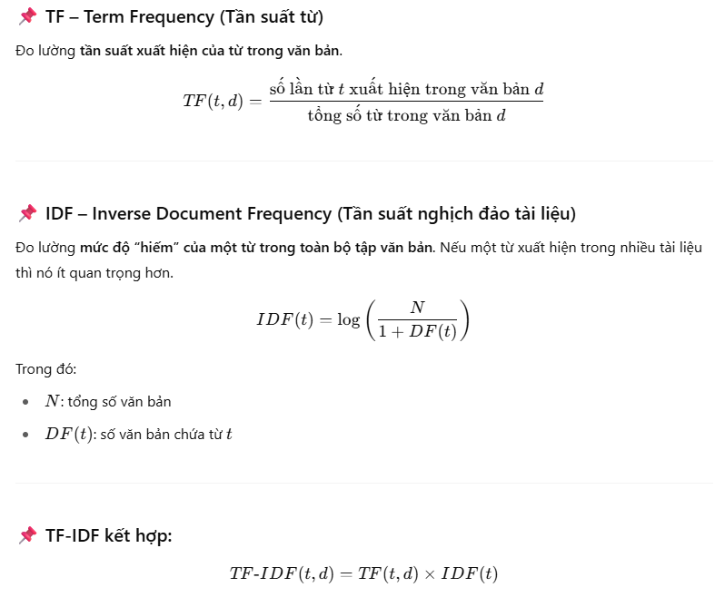
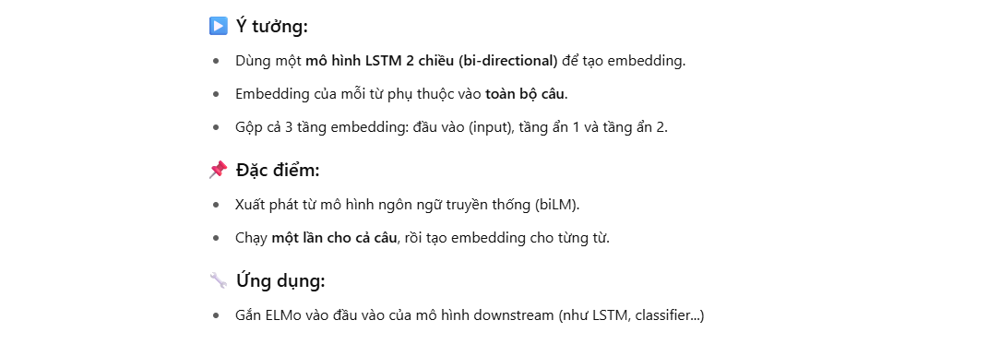
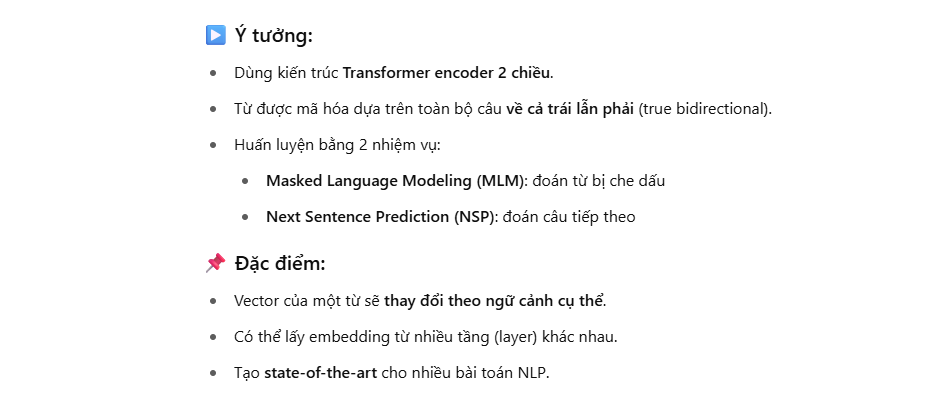

### Tokenization là gì?

Tokenization (phân tách từ) là quá trình chia nhỏ văn bản thành các đơn vị nhỏ hơn gọi là “token”. Mỗi token thường là một từ, nhưng tùy vào ngữ cảnh, token có thể là một ký tự, từ, hoặc thậm chí là cụm từ.

### Các cách chuẩn hóa văn bản?

- Chuyển về chữ thường:

```
text = "Hello World!" → "hello world!"
```

- Loại bỏ dấu câu:

```
"hello, how are you?" → "hello how are you"
```

- Loại bỏ khoảng trắng thừa:

```
"I   am   fine" → "I am fine"
```

- Chuẩn hóa unicode:

```
"Thầy giáo dạy toán" và "Thầy giáo dạy toán" (có thể khác nhau nếu dùng dấu tổ hợp)
```

- Loại bỏ stop words:
  Stop words là những từ thường gặp nhưng ít mang nghĩa như: "a", "the", "is", "and" (hoặc trong tiếng Việt: "là", "của", "và", "nhưng").

```
"I am a student" → "student"
```

- Stemming / Lemmatization:
  - Stemming: cắt phần hậu tố để đưa từ về gốc (ví dụ: "running", "runs" → "run")
  - Lemmatization: giống stemming nhưng dùng từ điển để đưa về đúng gốc ngữ pháp

```
"running", "ran", "runs" → "run"
```

- Thay thế viết tắt (Expand contractions):

```
"don't" → "do not"
"can't" → "cannot"
```

- Chuyển đổi số và ký hiệu đặc biệt:
  Loại bỏ số: "I have 2 dogs" → "I have dogs" . Hoặc giữ số lại nếu cần thiết

- Chuẩn hóa chính tả (nếu có):
  Dùng các thư viện để sửa lỗi chính tả:

```
"heloo" → "hello"
```

### Bag of Words là gì?

- BoW xem một văn bản như một tập hợp (bag) các từ (words), bỏ qua ngữ pháp và thứ tự từ, chỉ quan tâm đến:

  - Các từ gì xuất hiện trong văn bản.
  - Tần suất xuất hiện của chúng (số lần lặp lại mỗi từ).

- Cách hoạt đôngj của BoW:
  Lấy tất cả các từ trong tập văn bản và tạo thành một danh sách duy nhất (loại trùng lặp).

Ví dụ với 2 câu sau:

```
1. "I love NLP"
2. "I love deep learning"
```

Sẽ tạo thành Vocabulary: ["I", "love", "NLP", "deep", "learning"]

Sau đó biểu diễn mỗi văn bản thành vector đếm từ:
| Văn bản | I | love | NLP | deep | learning |
| ------------------------- | - | ---- | --- | ---- | -------- |
| 1. "I love NLP" | 1 | 1 | 1 | 0 | 0 |
| 2. "I love deep learning" | 1 | 1 | 0 | 1 | 1 |

- Một số biết thể của BoW:
  - Count Vectorizer: đơn thuần đếm số lần mỗi từ xuất hiện (như ví dụ trên).
  - Binary BoW: chỉ quan tâm từ có xuất hiện hay không (1 hoặc 0).
  - TF-IDF (Term Frequency – Inverse Document Frequency): Thay vì chỉ đếm tần suất, TF-IDF giảm trọng số của từ phổ biến và tăng trọng số của từ đặc trưng.
- Ưu điểm của BoW:
  - Tốc độ nhanh.
  - Dễ hiểu dễ triển khai.
  - Hiệu quả vơí dữ liệu nhỏ.
  - Là nền tảng cho các mô hình đơn giản như Naive Bayes, Logistic Regression
- Nhược điểm của BoW:
  - Bỏ qua ngữ cảnh và thứ tự từ
  - Tạo ra vector rất lớn nếu tập từ vựng lớn (sparse matrix)
  - Không hiểu ý nghĩa ngữ nghĩa giữa các từ (ví dụ "dog" và "puppy" được xem là hoàn toàn khác nhau)

### TF-IDF:

TF-IDF là viết tắt của Term Frequency – Inverse Document Frequency, là một kỹ thuật dùng để đánh giá mức độ quan trọng của một từ trong một văn bản so với toàn bộ tập văn bản. Đây là một cải tiến so với Bag of Words (BoW), giúp giảm trọng số của các từ phổ biến và tăng trọng số của các từ đặc trưng hơn.



- Ưu điểm của TF-IDF
  - Giảm ảnh hưởng của từ phổ biến (như "the", "is", "and")
  - Làm nổi bật các từ mang tính phân biệt
  - Đơn giản, dễ triển khai
- Nhược điểm
  - Bỏ qua ngữ cảnh (ngữ nghĩa)
  - Không hiểu mối quan hệ giữa các từ
  - Không xử lý tốt từ đồng nghĩa / đa nghĩa

### Word Embedding:

Word Embedding là kỹ thuật trong NLP dùng để biến đổi từ (word) thành vector số thực nhiều chiều, sao cho các từ có ý nghĩa giống nhau sẽ có vector gần nhau trong không gian vector. Đây là bước quan trọng giúp mô hình hiểu được ý nghĩa của từ.
Ví dụ: ```

```
"king" → [0.25, 0.13, ..., -0.47] (vector 100 chiều)
```

- Vì sao cần Word Embedding thay vì BoW/TF-IDF?
  | Tiêu chí | BoW/TF-IDF | Word Embedding |
  | ---------------------- | --------------- | ---------------------------- |
  | Kích thước vector | Rất lớn, sparse | Nhỏ gọn, dense |
  | Hiểu ngữ nghĩa | ❌ Không | ✅ Có |
  | Từ đồng nghĩa gần nhau | ❌ Không | ✅ Có (vì vector gần nhau) |
  | So sánh từ | Khó | Dễ (dùng khoảng cách cosine) |
- Các phương pháp Word Embedding phổ biến:

  - Word2Vec (Google, 2013)
    Có 2 mô hình:
    - CBOW (Continuous Bag of Words): dự đoán từ trung tâm từ ngữ cảnh xung quanh.
    - Skip-Gram: dự đoán từ xung quanh từ trung tâm.
  - GloVe (Global Vectors, Stanford, 2014)
    Ý tưởng:
    - GloVe không dựa vào ngữ cảnh cục bộ như Word2Vec.
    - Nó xây dựng ma trận đồng xuất hiện toàn cục của từ (co-occurrence matrix) trên toàn bộ tập văn bản.
    - Tối ưu để biểu diễn mối quan hệ giữa từ bằng vector.
      Kết hợp sức mạnh của Word2Vec và thống kê toàn văn bản và học nhanh hơn trên dữ liệu lớn
  - FastText (Facebook, 2016)
    FastText chia từ thành n-gram ký tự và học vector cho cả n-gram đó.
    Ví dụ: từ "playing" gồm các n-gram: "pla", "lay", "ayi", "yin", "ing"
    - Ưu điểm vượt trội:
      - Hiểu được từ chưa từng thấy (OOV – Out Of Vocabulary) bằng cách tổng hợp từ n-gram
      - Tốt cho các ngôn ngữ có cấu trúc phức tạp (ví dụ: tiếng Việt, tiếng Đức...)

### Contextual Embeddings

- Các phương pháp cũ như Word2Vec hay GloVe:
  - Gán mỗi từ một vector cố định, dù nó có nhiều nghĩa khác nhau.
  - Không hiểu được đa nghĩa hoặc sự thay đổi ý nghĩa theo ngữ cảnh.

Chúng dùng mô hình ngôn ngữ sâu (deep language models) để tạo ra vector cho mỗi từ, phụ thuộc vào ngữ cảnh xung quanh.

- ELMo (Embeddings from Language Models – 2018)
  
- BERT (Bidirectional Encoder Representations from Transformers – 2018)
  
- So sánh nhanh: Word2Vec vs ELMo vs BERT:
  | Đặc điểm | Word2Vec | ELMo | BERT |
  | ------------ | -------------- | ---------------------- | --------------------------------- |
  | Dạng vector | Cố định | Thay đổi theo ngữ cảnh | Thay đổi theo ngữ cảnh |
  | Kiến trúc | Shallow | Bi-LSTM | Transformer (bi-encoder) |
  | Ngữ cảnh | Không có | 2 chiều (BiLSTM) | 2 chiều (Transformer) |
  | Hiệu quả | Trung bình | Tốt | Rất tốt (SOTA nhiều task) |
  | Từ mới (OOV) | ❌ Không hỗ trợ | ✅ Có phần nào | ✅ Hỗ trợ bằng subword (WordPiece) |
- Khi nào nên dùng gì?
  | Mục đích | Gợi ý dùng |
  | ------------------------------------------- | ------------------------------------------------ |
  | Bài toán đơn giản, ít tài nguyên | Word2Vec, GloVe |
  | Cần hiểu ý nghĩa từ theo ngữ cảnh | ELMo hoặc BERT |
  | Hệ thống phức tạp, yêu cầu độ chính xác cao | ✅ BERT hoặc các biến thể như RoBERTa, DistilBERT |
- Ứng dụng thực tế của Contextual Embedding
  - Phân tích cảm xúc, chatbot, tìm kiếm ngữ nghĩa
  - Dịch máy, trích xuất thông tin, gợi ý nội dung
  - Các mô hình RAG, hệ thống hỏi đáp (QA), v.v.
