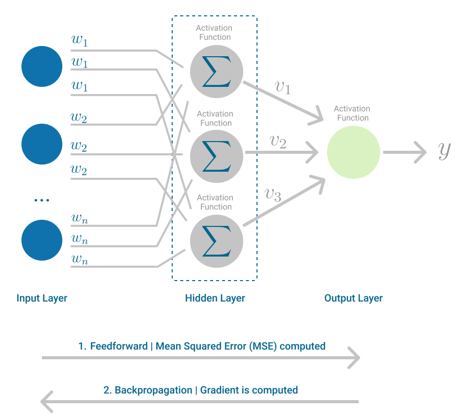

# 🔗 Multi Layer Perceptron (MLP)

## 📖 Giới thiệu

Multi Layer Perceptron (MLP) là một mạng neural nhân tạo gồm nhiều lớp perceptron được kết nối với nhau. MLP là sự mở rộng của Single Layer Perceptron, được phát triển để khắc phục những hạn chế của mô hình một lớp và có khả năng giải quyết các bài toán phi tuyến phức tạp.



## 🏗️ Kiến trúc

MLP bao gồm:

- **Lớp đầu vào (Input Layer)**: Nhận dữ liệu đầu vào
- **Lớp ẩn (Hidden Layer)**: Một hoặc nhiều lớp xử lý trung gian
- **Lớp đầu ra (Output Layer)**: Tạo ra kết quả cuối cùng

Mỗi lớp được kết nối đầy đủ (fully connected) với lớp tiếp theo.

## ⚙️ Cách thức hoạt động

### Forward Propagation

1. **Đầu vào**: Dữ liệu được truyền từ lớp input
2. **Tính toán lớp ẩn**: Mỗi neuron tính `z = Σ(wᵢ × xᵢ) + b`
3. **Hàm kích hoạt**: Áp dụng hàm kích hoạt `a = f(z)`
4. **Truyền tiếp**: Kết quả được truyền đến lớp tiếp theo
5. **Đầu ra**: Lớp cuối tạo ra dự đoán

### Backpropagation

1. **Tính sai số**: So sánh đầu ra với giá trị thực
2. **Lan truyền ngược**: Truyền sai số ngược về các lớp trước
3. **Cập nhật trọng số**: Sử dụng gradient descent để điều chỉnh weights và bias

## 🧮 Công thức

### Forward Pass

```
zⱼ⁽ˡ⁾ = Σᵢ wᵢⱼ⁽ˡ⁾ × aᵢ⁽ˡ⁻¹⁾ + bⱼ⁽ˡ⁾
aⱼ⁽ˡ⁾ = f(zⱼ⁽ˡ⁾)
```

### Backpropagation

```
δⱼ⁽ˡ⁾ = (∂C/∂zⱼ⁽ˡ⁾)
∂C/∂wᵢⱼ⁽ˡ⁾ = aᵢ⁽ˡ⁻¹⁾ × δⱼ⁽ˡ⁾
```

Trong đó:

- `l`: chỉ số lớp
- `w`: trọng số
- `a`: giá trị kích hoạt
- `z`: tổng có trọng số
- `δ`: sai số
- `C`: hàm cost

## 📊 Hàm kích hoạt

- **Sigmoid**: `σ(x) = 1/(1 + e^(-x))`
- **ReLU**: `f(x) = max(0, x)`
- **Tanh**: `tanh(x) = (e^x - e^(-x))/(e^x + e^(-x))`
- **Softmax**: `softmax(xᵢ) = e^(xᵢ)/Σⱼe^(xⱼ)`

## ✅ Ưu điểm

- **Khả năng phi tuyến**: Giải quyết được các bài toán phi tuyến phức tạp
- **Linh hoạt**: Có thể điều chỉnh số lớp và số neuron
- **Universal Approximator**: Có thể xấp xỉ bất kỳ hàm liên tục nào
- **Đa dạng ứng dụng**: Phù hợp với nhiều loại bài toán
- **Khả năng học**: Tự động học các đặc trưng từ dữ liệu

## ⚠️ Hạn chế

- **Phức tạp**: Khó điều chỉnh và tối ưu hóa
- **Overfitting**: Dễ bị học thuộc lòng dữ liệu training
- **Vanishing Gradient**: Gradient có thể biến mất ở các lớp sâu
- **Tính toán**: Yêu cầu nhiều tài nguyên tính toán
- **Black Box**: Khó giải thích cách mô hình đưa ra quyết định

## 🎯 Ứng dụng

- **Phân loại hình ảnh**: Nhận dạng đối tượng, khuôn mặt
- **Xử lý ngôn ngữ tự nhiên**: Phân tích sentiment, dịch máy
- **Dự đoán**: Giá cổ phiếu, thời tiết, xu hướng thị trường
- **Y tế**: Chẩn đoán bệnh, phân tích hình ảnh y khoa
- **Tài chính**: Phát hiện gian lận, đánh giá rủi ro
- **Game AI**: Cờ vua, Go, game strategy

## 🛠️ Hyperparameters quan trọng

- **Số lớp ẩn**: Độ sâu của mạng
- **Số neuron mỗi lớp**: Độ rộng của mạng
- **Learning rate**: Tốc độ học
- **Batch size**: Kích thước mẻ dữ liệu
- **Epochs**: Số lần huấn luyện
- **Regularization**: L1, L2, Dropout

## 💡 Tips tối ưu

- **Chuẩn hóa dữ liệu**: Normalize input data
- **Khởi tạo trọng số**: Sử dụng Xavier/He initialization
- **Regularization**: Áp dụng dropout, batch normalization
- **Learning rate scheduling**: Giảm dần learning rate
- **Early stopping**: Dừng khi validation loss không cải thiện
- **Cross-validation**: Đánh giá mô hình một cách khách quan

## 🔄 So sánh với SLP

| Đặc điểm           | SLP        | MLP       |
| ------------------ | ---------- | --------- |
| Số lớp             | 1          | ≥ 2       |
| Bài toán           | Tuyến tính | Phi tuyến |
| Độ phức tạp        | Thấp       | Cao       |
| Khả năng học       | Hạn chế    | Mạnh mẽ   |
| Thời gian training | Nhanh      | Chậm      |

## 💡 Kết luận

Multi Layer Perceptron là nền tảng quan trọng của deep learning hiện đại. Với khả năng học các mẫu phức tạp và đa dạng ứng dụng, MLP đã mở đường cho sự phát triển của các kiến trúc neural network tiên tiến như CNN, RNN, và Transformer. Việc hiểu rõ MLP là bước đệm quan trọng để tiếp cận các công nghệ AI phức tạp hơn.
