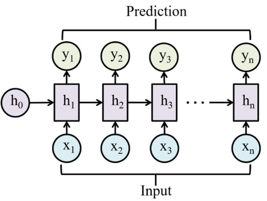
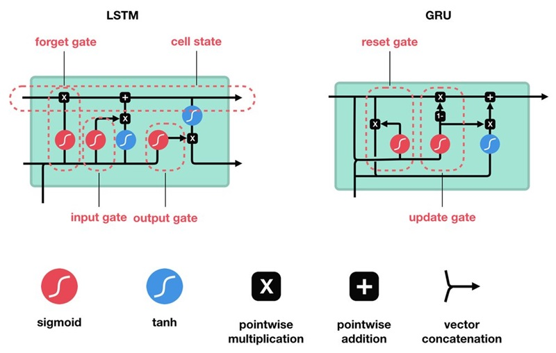

# 🔄 Recurrent Neural Networks: RNN, LSTM & GRU

## 📖 Giới thiệu

Recurrent Neural Networks (RNNs) là một họ mạng neural được thiết kế đặc biệt để xử lý dữ liệu tuần tự (sequential data). Khác với feedforward networks, RNNs có khả năng "nhớ" thông tin từ các bước thời gian trước đó thông qua các kết nối lặp lại (recurrent connections). Điều này làm cho RNNs trở thành lựa chọn lý tưởng cho các tác vụ liên quan đến chuỗi dữ liệu như xử lý ngôn ngữ tự nhiên, nhận dạng giọng nói, và dự đoán chuỗi thời gian.



---

## 🎯 RNN (Recurrent Neural Network)

### 🏗️ Kiến trúc cơ bản

RNN cơ bản có cấu trúc đơn giản với một hidden state được truyền qua các time steps:

```
h_t = tanh(W_h × h_{t-1} + W_x × x_t + b)
y_t = W_y × h_t + b_y
```

### ⚙️ Cách thức hoạt động

1. **Input**: Nhận input sequence x₁, x₂, ..., xₜ
2. **Hidden State**: Duy trì hidden state h_t qua các time steps
3. **Memory**: h_t chứa thông tin từ tất cả inputs trước đó
4. **Output**: Tạo output y_t tại mỗi time step (tùy chọn)

### 🔄 Các kiểu RNN

- **One-to-One**: Input và output đơn lẻ
- **One-to-Many**: Một input, nhiều outputs (text generation)
- **Many-to-One**: Nhiều inputs, một output (sentiment analysis)
- **Many-to-Many**: Nhiều inputs và outputs (machine translation)

### ✅ Ưu điểm RNN

- **Sequential Processing**: Xử lý dữ liệu tuần tự tự nhiên
- **Memory**: Có khả năng ghi nhớ thông tin từ quá khứ
- **Variable Length**: Xử lý sequences có độ dài khác nhau
- **Parameter Sharing**: Chia sẻ tham số qua time steps
- **Flexibility**: Nhiều kiến trúc input-output khác nhau

### ⚠️ Hạn chế RNN

- **Vanishing Gradient**: Gradient biến mất ở sequences dài
- **Short-term Memory**: Khó ghi nhớ thông tin xa trong quá khứ
- **Sequential Processing**: Không thể song song hóa training
- **Exploding Gradient**: Gradient có thể tăng đột ngột
- **Computational Inefficiency**: Chậm với sequences dài

---



## 🚪 LSTM (Long Short-Term Memory)

### 📖 Giới thiệu LSTM

LSTM được phát triển bởi Hochreiter và Schmidhuber (1997) để giải quyết vấn đề vanishing gradient của RNN. LSTM sử dụng một cơ chế gate phức tạp để kiểm soát luồng thông tin.

### 🏗️ Kiến trúc LSTM

LSTM có 4 thành phần chính:

1. **Cell State (C_t)**: Dòng thông tin chính
2. **Forget Gate**: Quyết định thông tin nào cần quên
3. **Input Gate**: Quyết định thông tin mới nào cần lưu
4. **Output Gate**: Quyết định phần nào của cell state sẽ output

### 🧮 Công thức LSTM

```
# Forget Gate
f_t = σ(W_f × [h_{t-1}, x_t] + b_f)

# Input Gate
i_t = σ(W_i × [h_{t-1}, x_t] + b_i)
C̃_t = tanh(W_C × [h_{t-1}, x_t] + b_C)

# Cell State Update
C_t = f_t × C_{t-1} + i_t × C̃_t

# Output Gate
o_t = σ(W_o × [h_{t-1}, x_t] + b_o)
h_t = o_t × tanh(C_t)
```

### ⚙️ Cơ chế hoạt động LSTM

1. **Forget Gate**: Xóa thông tin không cần thiết từ cell state
2. **Input Gate**: Chọn thông tin mới để lưu vào cell state
3. **Update Cell State**: Cập nhật cell state với thông tin mới
4. **Output Gate**: Tạo hidden state từ cell state

### ✅ Ưu điểm LSTM

- **Long-term Memory**: Ghi nhớ thông tin trong thời gian dài
- **Gradient Flow**: Giải quyết vấn đề vanishing gradient
- **Selective Memory**: Chọn lọc thông tin cần ghi nhớ/quên
- **Stable Training**: Training ổn định hơn RNN cơ bản
- **Versatile**: Hiệu quả cho nhiều tác vụ sequence

### ⚠️ Hạn chế LSTM

- **Computational Complexity**: Phức tạp hơn RNN cơ bản
- **Memory Requirements**: Cần nhiều bộ nhớ hơn
- **Training Time**: Lâu hơn để training
- **Overfitting**: Dễ overfit với datasets nhỏ

---

## ⚡ GRU (Gated Recurrent Unit)

### 📖 Giới thiệu GRU

GRU được giới thiệu bởi Cho et al. (2014) như một phiên bản đơn giản hóa của LSTM. GRU kết hợp forget gate và input gate thành một update gate, làm giảm độ phức tạp tính toán.

### 🏗️ Kiến trúc GRU

GRU có 2 gates chính:

1. **Reset Gate (r_t)**: Quyết định bỏ quên bao nhiều thông tin từ quá khứ
2. **Update Gate (z_t)**: Quyết định cập nhật bao nhiều thông tin mới

### 🧮 Công thức GRU

```
# Reset Gate
r_t = σ(W_r × [h_{t-1}, x_t] + b_r)

# Update Gate
z_t = σ(W_z × [h_{t-1}, x_t] + b_z)

# Candidate Hidden State
h̃_t = tanh(W_h × [r_t × h_{t-1}, x_t] + b_h)

# Final Hidden State
h_t = (1 - z_t) × h_{t-1} + z_t × h̃_t
```

### ⚙️ Cơ chế hoạt động GRU

1. **Reset Gate**: Kiểm soát việc kết hợp thông tin từ quá khứ
2. **Update Gate**: Cân bằng giữa thông tin cũ và mới
3. **Candidate State**: Tạo hidden state ứng viên
4. **Final State**: Kết hợp thông tin cũ và mới theo tỷ lệ

### ✅ Ưu điểm GRU

- **Simpler Architecture**: Đơn giản hơn LSTM (2 gates vs 3 gates)
- **Faster Training**: Training nhanh hơn LSTM
- **Fewer Parameters**: Ít tham số hơn LSTM
- **Good Performance**: Hiệu suất tương đương LSTM trong nhiều tác vụ
- **Less Overfitting**: Ít overfit hơn do ít tham số

### ⚠️ Hạn chế GRU

- **Less Control**: Ít kiểm soát hơn LSTM đối với luồng thông tin
- **Recent Development**: Ít nghiên cứu hơn LSTM
- **Task Dependent**: Hiệu suất phụ thuộc vào tác vụ cụ thể

---

## 🔄 So sánh RNN, LSTM, GRU

| Đặc điểm             | RNN               | LSTM              | GRU                       |
| -------------------- | ----------------- | ----------------- | ------------------------- |
| **Độ phức tạp**      | Thấp              | Cao               | Trung bình                |
| **Số parameters**    | Ít                | Nhiều             | Trung bình                |
| **Tốc độ training**  | Nhanh             | Chậm              | Trung bình                |
| **Memory capacity**  | Ngắn              | Dài               | Dài                       |
| **Gradient problem** | Có                | Ít                | Ít                        |
| **Hiệu suất**        | Kém               | Tốt               | Tốt                       |
| **Use case**         | Sequence đơn giản | Sequence phức tạp | Cân bằng hiệu suất/tốc độ |

## 🎯 Ứng dụng

### Natural Language Processing

- **Machine Translation**: Dịch máy (Seq2Seq)
- **Text Generation**: Tạo văn bản, thơ, code
- **Sentiment Analysis**: Phân tích cảm xúc
- **Named Entity Recognition**: Nhận dạng thực thể
- **Chatbots**: Hệ thống hỏi đáp tự động

### Speech & Audio

- **Speech Recognition**: Nhận dạng giọng nói
- **Speech Synthesis**: Tổng hợp giọng nói
- **Music Generation**: Tạo nhạc tự động
- **Audio Classification**: Phân loại âm thanh

### Time Series

- **Stock Prediction**: Dự đoán giá cổ phiếu
- **Weather Forecasting**: Dự báo thời tiết
- **Sales Forecasting**: Dự đoán doanh số
- **Anomaly Detection**: Phát hiện bất thường

### Computer Vision

- **Video Analysis**: Phân tích video
- **Action Recognition**: Nhận dạng hành động
- **Image Captioning**: Tạo chú thích hình ảnh
- **Object Tracking**: Theo dõi đối tượng

## 🛠️ Hyperparameters quan trọng

### Architecture

- **Hidden Size**: Số neurons trong hidden layer
- **Number of Layers**: Số lớp RNN (1-3 layers thường)
- **Bidirectional**: RNN hai chiều
- **Dropout**: Tỷ lệ dropout giữa các layers

### Training

- **Learning Rate**: 0.001, 0.01 (thường nhỏ hơn CNN)
- **Batch Size**: 32, 64, 128
- **Sequence Length**: Độ dài sequence input
- **Gradient Clipping**: Ngăn exploding gradient

### Optimization

- **Optimizer**: Adam, RMSprop, SGD
- **Loss Function**: CrossEntropy, MSE, CTC
- **Regularization**: L1/L2, Dropout, Batch Norm

## 💡 Tips tối ưu

### Data Preparation

- **Sequence Padding**: Đồng nhất độ dài sequences
- **Normalization**: Chuẩn hóa dữ liệu đầu vào
- **Tokenization**: Chuyển text thành tokens
- **Bucketing**: Nhóm sequences theo độ dài

### Training Strategy

- **Gradient Clipping**: Clip gradients để tránh exploding
- **Teacher Forcing**: Sử dụng ground truth làm input
- **Curriculum Learning**: Training từ dễ đến khó
- **Attention Mechanism**: Thêm attention để cải thiện hiệu suất

### Architecture Choices

- **LSTM vs GRU**: GRU cho tốc độ, LSTM cho hiệu suất
- **Bidirectional**: Sử dụng khi có thể nhìn cả quá khứ và tương lai
- **Stacking**: 2-3 layers thường tối ưu
- **Residual Connections**: Cho mạng sâu

## 📈 Metrics đánh giá

### Text Generation

- **Perplexity**: Độ bối rối của model
- **BLEU Score**: Chất lượng translation
- **ROUGE Score**: Chất lượng summarization

### Classification

- **Accuracy**: Độ chính xác
- **F1-Score**: Cân bằng precision-recall
- **Confusion Matrix**: Ma trận nhầm lẫn

### Time Series

- **MAE**: Mean Absolute Error
- **RMSE**: Root Mean Square Error
- **MAPE**: Mean Absolute Percentage Error

## 🚀 Xu hướng hiện đại

### Transformer Architecture

- **Self-Attention**: Thay thế RNN trong nhiều tác vụ
- **BERT, GPT**: Pre-trained language models
- **Parallel Processing**: Xử lý song song hiệu quả

### Hybrid Approaches

- **CNN-RNN**: Kết hợp CNN và RNN
- **Attention + RNN**: Thêm attention mechanism
- **Graph RNN**: RNN cho dữ liệu đồ thị

## 💡 Kết luận

RNN, LSTM, và GRU tạo thành bộ ba công cụ mạnh mẽ cho việc xử lý dữ liệu tuần tự. Mỗi kiến trúc có những ưu nhược điểm riêng:

- **RNN**: Đơn giản, nhanh, phù hợp cho sequences ngắn
- **LSTM**: Mạnh mẽ, nhớ lâu, phù hợp cho tác vụ phức tạp
- **GRU**: Cân bằng giữa hiệu suất và tốc độ

Mặc dù Transformer đã thay thế RNNs trong nhiều tác vụ NLP, hiểu rõ RNN family vẫn quan trọng vì chúng vẫn hữu ích trong nhiều ứng dụng đặc biệt và là nền tảng để hiểu các kiến trúc sequence modeling hiện đại.
