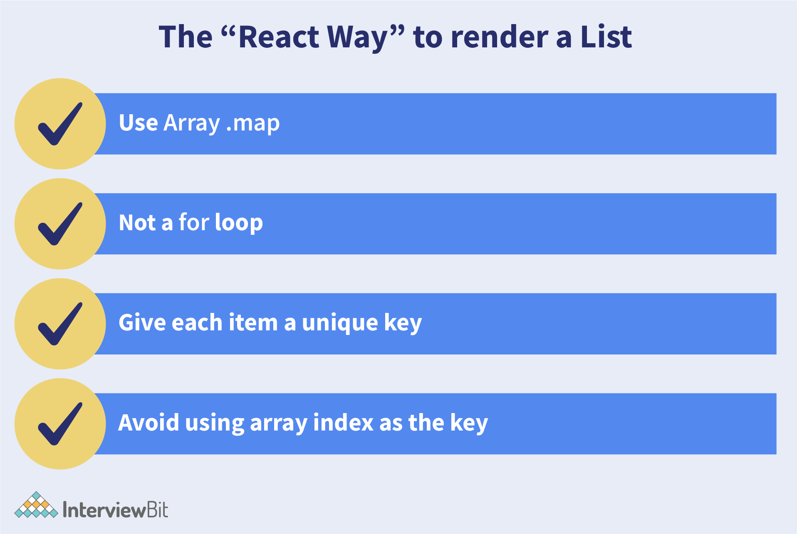
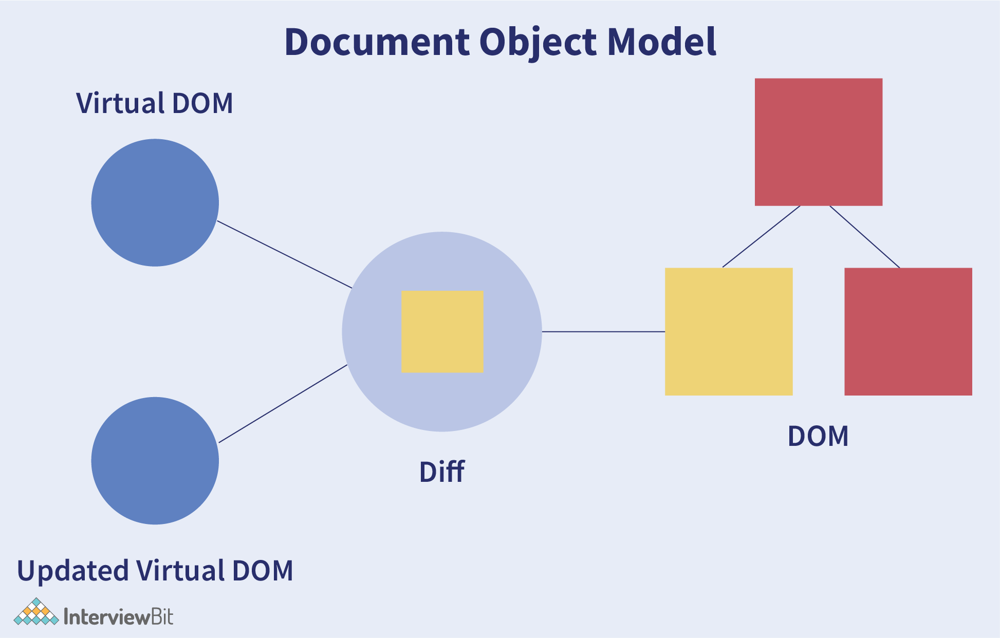
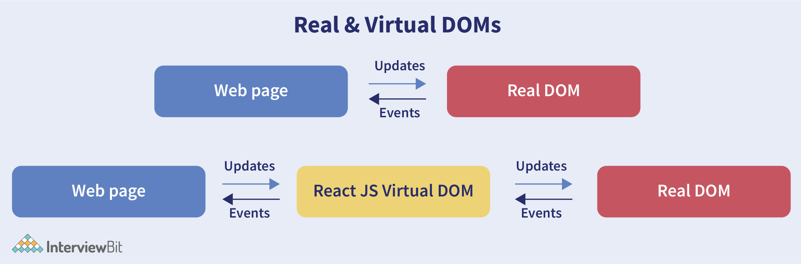
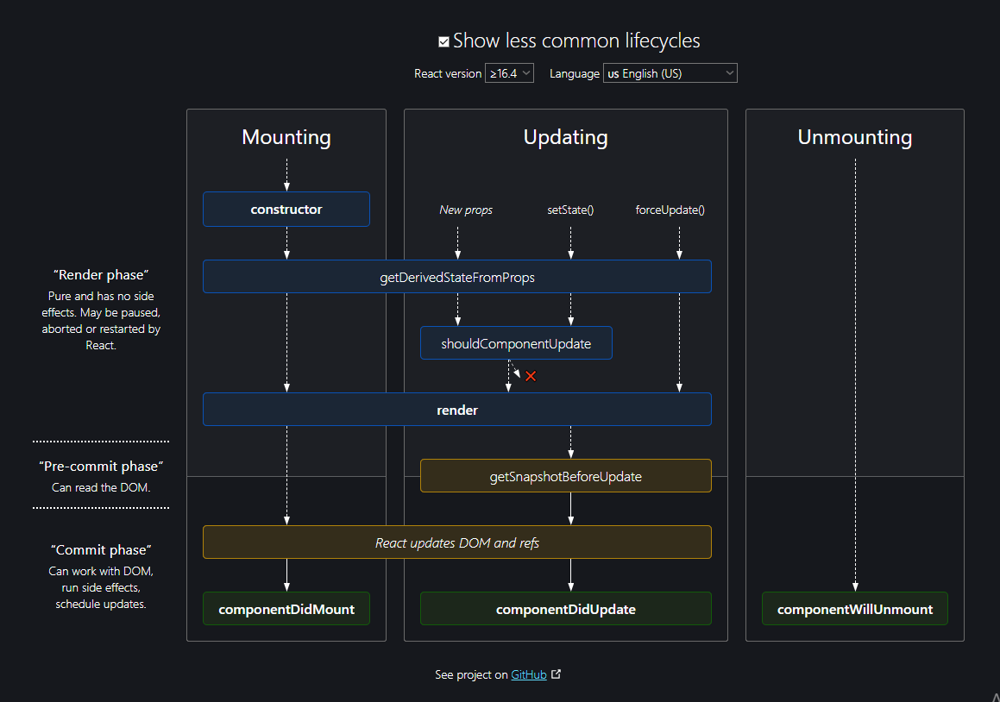
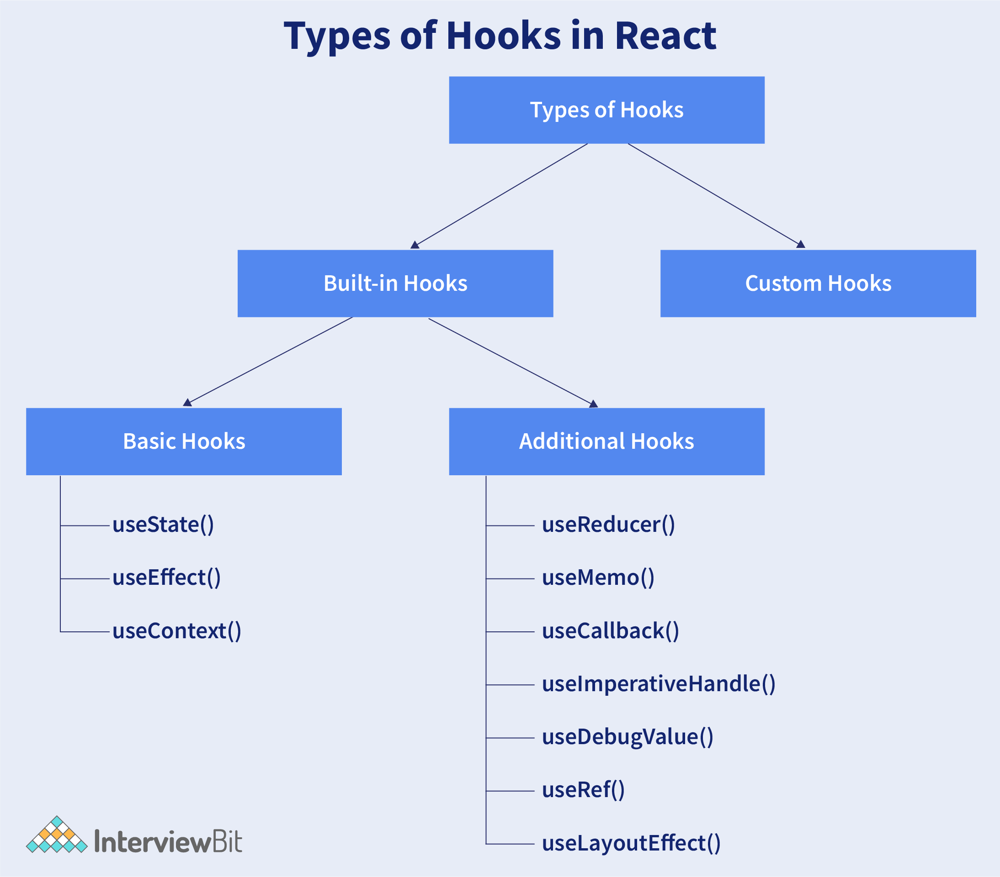

# Câu hỏi phỏng vấn React


React là một thư viện JavaScript mã nguồn mở, linh hoạt và hiệu quả cho phép các nhà phát triển tạo ra các ứng dụng web đơn giản, nhanh chóng và có thể mở rộng. Jordan Walke, một kỹ sư phần mềm làm việc cho Facebook đã tạo ra React. Nó được triển khai lần đầu tiên trên news feed của Facebook vào năm 2011 và trên Instagram vào năm 2012. Các nhà phát triển từ nền tảng Javascript có thể dễ dàng phát triển các ứng dụng web với sự trợ giúp của React.

Ở hiện tại, việc lựa chọn công nghệ phù hợp để ứng dụng hoặc phát triển web đang trở nên khó khăn hơn. React đã được coi là thư viện/framework frontend phát triển nhanh nhất trong số tất cả. Sự phát triển của Javascript đang nổi lên và ổn định trên thị trường và nhu cầu tuyển dụng React đang tăng lên theo cấp số nhân. React rõ ràng là một lợi thế đối với các nhà phát triển front-end vì nó có đường cong học tập nhanh, trừu tượng rõ ràng và các thành phần có thể tái sử dụng. Hiện tại, vẫn chưa có dấu hiệu dừng cho React vì nó vẫn sẽ tiếp tục phát triển.

## Mục lục

[1. React là gì](#1-react-là-gì)

[2. Lợi ích khi dùng React?](#2-lợi-ích-khi-dùng-react)

[3. Hạn chế của React?](#3-hạn-chế-của-react)

[4. useState() trong React là gì?](#4-usestate-trong-react-là-gì)

[5. Keys trong React?](#5-keys-trong-react)

[6. JSX là gì?](#6-jsx-l%C3%A0-g%C3%AC)

[7. Sự khác biệt giữa class component và function component?](#7-s%E1%BB%B1-kh%C3%A1c-bi%E1%BB%87t-gi%E1%BB%AFa-class-component-v%C3%A0-function-component)

[8. Virtual DOM là gì?](#8-virtual-dom-l%C3%A0-g%C3%AC)

[9. Sự khác biệt giữa controlled component và uncontrolled component?](#9-s%E1%BB%B1-kh%C3%A1c-bi%E1%BB%87t-gi%E1%BB%AFa-controlled-component-v%C3%A0-uncontrolled-component)

[10. Props trong React là gì?](#10-props-trong-react-l%C3%A0-g%C3%AC)

[11. Giải thích state và props?](#11-gi%E1%BA%A3i-th%C3%ADch-state-v%C3%A0-props)

[12. Các kiểu side effect trong React component?](#12-c%C3%A1c-ki%E1%BB%83u-side-effect-trong-react-component)

[13. Prop drilling trong React?](#13-prop-drilling-trong-react)

[14. Error boundary là gì?](#14-error-boundary-l%C3%A0-g%C3%AC)

[15. React Hooks là gì?](#15-react-hooks-l%C3%A0-g%C3%AC)

[16. Tại sao lại cần React Hook?](#16-t%E1%BA%A1i-sao-l%E1%BA%A1i-c%E1%BA%A7n-react-hook)

[17. Các quy tắc sử dụng React Hooks?](#17-c%C3%A1c-quy-t%E1%BA%AFc-s%E1%BB%AD-d%E1%BB%A5ng-react-hooks)

[18. Cách dùng useEffect?](#18-c%C3%A1ch-d%C3%B9ng-useeffect)

[19. Sử dụng refs với React Hooks?](#19-s%E1%BB%AD-d%E1%BB%A5ng-refs-v%E1%BB%9Bi-react-hooks)

[20. Hook tuỳ chỉnh là gì?](#20-hook-tu%E1%BB%B3-ch%E1%BB%89nh-l%C3%A0-g%C3%AC)

[21. Strict mode trong React là gì?](#21-strict-mode-trong-react-l%C3%A0-g%C3%AC)

[22. Ngăn chặn re-render trong React?](#22-ng%C4%83n-ch%E1%BA%B7n-re-render-trong-react)

[23. Các cách khác nhau để chỉnh style component?](#23-c%C3%A1c-c%C3%A1ch-kh%C3%A1c-nhau-%C4%91%E1%BB%83-ch%E1%BB%89nh-style-component)

[24. Các kỹ thuật tối ưu hiệu suất ứng dụng React?](#24-c%C3%A1c-k%E1%BB%B9-thu%E1%BA%ADt-t%E1%BB%91i-%C6%B0u-hi%E1%BB%87u-su%E1%BA%A5t-%E1%BB%A9ng-d%E1%BB%A5ng-react)

[25. Truyền dữ liệu giữa các component?](#25-truy%E1%BB%81n-d%E1%BB%AF-li%E1%BB%87u-gi%E1%BB%AFa-c%C3%A1c-component)

[26. High-Order Component là gì?](#26-high-order-component-l%C3%A0-g%C3%AC)

[27. Các giai đoạn trong vòng đời component?](#27-c%C3%A1c-giai-%C4%91o%E1%BA%A1n-trong-v%C3%B2ng-%C4%91%E1%BB%9Di-component)

[28. Các phương thức trong vòng đời component?](#28-c%C3%A1c-ph%C6%B0%C6%A1ng-th%E1%BB%A9c-trong-v%C3%B2ng-%C4%91%E1%BB%9Di-component)

[29. React hook có làm việc với static typing?](#29-react-hook-c%C3%B3-l%C3%A0m-vi%E1%BB%87c-v%E1%BB%9Bi-static-typing)

[30. Các kiểu Hooks trong React?](#30-c%C3%A1c-ki%E1%BB%83u-hooks-trong-react)

[31. Sự khác biệt giữa lớp và React Hook?](#31-s%E1%BB%B1-kh%C3%A1c-bi%E1%BB%87t-gi%E1%BB%AFa-l%E1%BB%9Bp-v%C3%A0-react-hook)

[32. Hiệu suất của React Hook so với lớp?](#32-hi%E1%BB%87u-su%E1%BA%A5t-c%E1%BB%A7a-react-hook-so-v%E1%BB%9Bi-l%E1%BB%9Bp)

[33. Các hook có thay thế được lớp hoàn toàn?](#33-c%C3%A1c-hook-c%C3%B3-thay-th%E1%BA%BF-%C4%91%C6%B0%E1%BB%A3c-l%E1%BB%9Bp-ho%C3%A0n-to%C3%A0n)

[34. React Router là gì?](#34-react-router-l%C3%A0-g%C3%AC)

[35. React Hook có thể thay thế Redux?](#35-react-hook-c%C3%B3-th%E1%BB%83-thay-th%E1%BA%BF-redux)

[36. Render có điều kiện trong React?](#36-render-c%C3%B3-%C4%91i%E1%BB%81u-ki%E1%BB%87n-trong-react)

[37. Sự khác biệt giữa NavLink và Link?](#37-s%E1%BB%B1-kh%C3%A1c-bi%E1%BB%87t-gi%E1%BB%AFa-navlink-v%C3%A0-link)

[38. withRouter trong react-router-dom là gì?](#38-withrouter-trong-react-router-dom-l%C3%A0-g%C3%AC)

[39. Cách hiển thị dữ liệu API với Axios?](#39-c%C3%A1ch-hi%E1%BB%83n-th%E1%BB%8B-d%E1%BB%AF-li%E1%BB%87u-api-v%E1%BB%9Bi-axios)

[40. Caching trong React?](#40-caching-trong-react)

## Câu hỏi phỏng vấn React cho Fresher

### 1. React là gì?

React là một thư viện JavaScript mã nguồn mở và giao diện người dùng, rất hữu ích trong việc phát triển giao diện người dùng dành riêng cho các ứng dụng SPA. Nó hữu ích trong việc xây dựng các thành phần giao diện người dùng (UI) phức tạp và có thể tái sử dụng của các ứng dụng web và di động vì nó tuân theo mô hình dựa trên component.

Tính năng của React:

- Tăng hiệu suất của ứng dụng với Virtual DOM.
- JSX làm cho code dễ đọc và viết.
- Nó kết xuất cả phía máy khách và máy chủ.
- Dễ dàng tích hợp với các frameworks khác (Angular, BackboneJS) vì nó chỉ là một thư viện giao diện.
- Dễ dàng viết các trường hợp kiểm thử UI và tích hợp với các công cụ như JEST.

### 2. Lợi ích khi dùng React?

- ReactJS giúp cho việc viết các đoạn code Javascript sẽ trở nên dễ dàng hơn vì nó sử dụng một cú pháp đặc biệt đó chính là cú pháp JSX. Thông qua JSX cho phép nhúng code HTML và Javascript.
- ReactJS cho phép nhà phát triển phá vỡ những cấu trúc UI phức tạp thành những component độc lập. Các nhà phát triển sẽ không phải lo lắng về tổng thể ứng dụng web, giờ đây có thể dễ dàng chia nhỏ các cấu trúc UI/UX phức tạp thành từng component đơn giản hơn.
- Đi kèm với ReactJS là rất nhiều các công cụ phát triển giúp cho việc debug code một cách dễ dàng hơn.
- Một trong những ưu điểm nữa của ReactJS đó là sự thân thiện với SEO. Hầu như các JS Frameworks không thân thiện với các tìm kiếm mặc dù đã được cải thiện nhiều nhưng dưới sự hỗ trợ của các render dữ liệu trả về dưới dạng web page giúp cho SEO chuẩn hơn.
- React cùng với React Native, Redux, Electro cùng với nhiều công cụ hữu ích khác giúp nhà phát triển xây dựng được đa dạng loại ứng dụng phù hợp với nhiều yêu cầu.

### 3. Hạn chế của React?

- React không phải một framework hoàn chỉnh mà chỉ là thư viện.
- Component trong React sẽ rất nhiều và mất nhiều thời gian để hiểu với các trang web phức tạp.
- Code sẽ trở nên phức tạp khi dùng template với JSX.
- Khá khó cho người mới bắt đầu.

### 4. useState() trong React là gì?

useState() là một hooks có sẵn trong React, cho phép bạn quản lý biến state của các function component. Nó được dùng khi DOM có thứ gì đó cần được điều khiển/quản lý.

Trong code bên dưới, `useState(0)` sẽ trả về một mảng trong đó tham số đầu tiên là state hiện tại của `counter` và tham số thứ hai là phương thức `setCounter` cho phép cập nhật state của counter.

```jsx
...
const [count, setCounter] = useState(0);
const [otherStuffs, setOtherStuffs] = useState(...);
...
const setCount = () => {
   setCounter(count + 1);
   setOtherStuffs(...);
   ...
};
```

Ta có thể sử dụng phương thức `setCounter()` cho cập nhật state của count ở bất cứ đâu. Trong ví dụ này, ta sử dụng `setCounter()` trong hàm `setCount` . Đây là một ý tưởng tuyệt với để quản lý state trong các function component, tránh sử dụng class component khi không cần thiết.

### 5. Keys trong React?

Key là một thuộc tính chuỗi đặc biệt dùng khi sử dụng danh sách phần tử.



Ví dụ:

```js
const ids = [1, 2, 3, 4, 5];
const listElements = ids.map((id) => {
  return <li key={id.toString()}>{id}</li>;
});
```

#### Ý nghĩa của keys

- Key giúp react định danh các phần tử được thêm, sửa hay xoá.
- Key được cho bởi mảng phần tử cho cung cấp định danh duy nhất của từng phần tử.
- Không dùng key, React sẽ không hiểu thứ tự của từng phần tử.
- Với key, React sẽ phân biệt các phần tử riêng lẻ được thêm, sửa và xoá.
- Key được dùng cho hiển thị danh sách dữ liệu từ API.

### 6. JSX là gì?

JSX là viết tắt của JavaScript XML. Nó cho phép ta viết HTML trong JavaScript và đặt nó vào DOM mà không cần dùng `appendChild()` hay `createElement()`.

Theo trang chủ của React, JSX cung cấp cú pháp tuyệt vời hơn cho `React.createElement()`. Ví dụ

- Không dùng JSX:

```js
const text = React.createElement("p", {}, "This is a text");
const container = React.createElement("div", "{}", text);
ReactDOM.render(container, rootElement);
```

- Dùng JSX:

```jsx
const container = (
  <div>
    <p>This is a text</p>
  </div>
);
ReactDOM.render(container, rootElement);
```

### 7. Sự khác biệt giữa class component và function component?

Trước khi giới thiệu hooks ở phiên bản 16, các function component được gọi là stateless component và ít khi được dùng trong React. Sau khi hook ra đời, các function component giờ đã ngang hàng với class component.

Dù function component đang là trend hiện tại, nhưng class component vẫn còn rất quan trọng. Dưới đây là một vài so sánh cơ bản:

- **Khai báo**

Function component giống như một hàm thông thường trong JS, ta có thể tạo kiểu arrow function hoặc function:

```jsx
function card(props) {
  return (
    <div className="main-container">
      <h2>Title of the card</h2>
    </div>
  );
}

const card = (props) => {
  return (
    <div className="main-container">
      <h2>Title of the card</h2>
    </div>
  );
};
```

Class component sử dụng cú pháp tạo lớp của ES6

```jsx
class Card extends React.Component {
  constructor(props) {
    super(props);
  }
  render() {
    return (
      <div className="main-container">
        <h2>Title of the card</h2>
      </div>
    );
  }
}
```

- **Xử lý props**

Ta thử render component dưới đây theo cả hai cách:

```jsx
<Student Info name="Vivek" rollNumber="23" />
```

Trong function component, xử lý props rất thẳng thắn. Bất ký props nào cũng được xem như tham số của function component có thể xử lý trực tiếp:

```jsx
function StudentInfo(props) {
  return (
    <div className="main">
      <h2>{props.name}</h2>
      <h4>{props.rollNumber}</h4>
    </div>
  );
}
```

Với class component, props được xử lý bằng `this`:

```jsx
class StudentInfo extends React.Component {
  constructor(props) {
    super(props);
  }

  render() {
    return (
      <div className="main">
        <h2>{this.props.name}</h2>
        <h4>{this.props.rollNumber}</h4>
      </div>
    );
  }
}
```

- **Xử lý state**

Function component sử dụng hook để quản lý state. Hook hữu ích nhất là `useState` cho thiết lập state trong component.

```jsx
function ClassRoom(props) {
  let [studentsCount, setStudentsCount] = useState(0);

  const addStudent = () => {
    setStudentsCount(++studentsCount);
  };

  return (
    <div>
      <p>Number of students in class room: {studentsCount}</p>
      <button onClick={addStudent}>Add Student</button>
    </div>
  );
}
```

Ta không thể sử dụng hook bên trong class component, thế nên ta vẫn phải xử lý state bằng `this` trong class component.

```jsx
class ClassRoom extends React.Component {
  constructor(props) {
    super(props);

    this.state = { studentsCount: 0 };
    this.addStudent = this.addStudent.bind(this);
  }

  addStudent() {
    this.setState((prevState) => {
      return { studentsCount: prevState.studentsCount++ };
    });
  }

  render() {
    return (
      <div>
        <p>Number of students in class room: {this.state.studentsCount}</p>
        <button onClick={this.addStudent}>Add Student</button>
      </div>
    );
  }
}
```

### 8. Virtual DOM là gì?

Virtual DOM là một khái niệm trong đó biểu diễn ảo của DOM thực được lưu giữ bên trong bộ nhớ và được đồng bộ hóa với DOM thực bởi một thư viện như ReactDOM.



#### Tại sao cần Virtual DOM

Thao tác DOM là một phần không thể thiếu của bất kỳ ứng dụng web nào, nhưng thao tác DOM khá chậm khi so sánh với các thao tác khác trong JavaScript. Hiệu quả của ứng dụng bị ảnh hưởng khi một số thao tác DOM đang được thực hiện. Hầu hết các framework JavaScript cập nhật toàn bộ DOM ngay cả khi một phần nhỏ của DOM thay đổi.

Ví dụ: hãy xem xét một danh sách đang được hiển thị bên trong DOM. Nếu một trong các mục trong danh sách thay đổi, toàn bộ danh sách sẽ được hiển thị lại thay vì chỉ hiển thị mục đã được thay đổi/cập nhật. Đây được gọi là cập nhật không hiệu quả.

Để giải quyết vấn đề cập nhật không hiệu quả, team React đã đưa ra khái niệm virtual DOM.



Đối với mỗi đối tượng DOM, có một đối tượng DOM ảo tương ứng (bản sao), có các thuộc tính giống nhau. Sự khác biệt chính giữa đối tượng DOM thực và đối tượng DOM ảo là bất kỳ thay đổi nào trong đối tượng DOM ảo sẽ không phản ánh trực tiếp trên màn hình. Hãy coi một đối tượng DOM ảo như một bản thiết kế của đối tượng DOM thực. Bất cứ khi nào một phần tử JSX được hiển thị, mọi đối tượng DOM ảo sẽ được cập nhật.

> Lưu ý- Người ta có thể nghĩ rằng việc cập nhật mọi đối tượng DOM ảo có thể không hiệu quả, nhưng không phải vậy. Cập nhật DOM ảo nhanh hơn nhiều so với cập nhật DOM thực vì chúng tôi chỉ cập nhật bản thiết kế của DOM thực.

React sử dụng hai virtual DOM để hiển thị giao diện người dùng. Một cái được sử dụng để lưu trữ trạng thái hiện tại của các đối tượng và cái còn lại để lưu trữ trạng thái trước đó của các đối tượng. Bất cứ khi nào DOM ảo được cập nhật, React so sánh hai DOM ảo và biết về đối tượng DOM ảo nào đã được cập nhật. Sau khi biết đối tượng nào đã được cập nhật, React chỉ hiển thị các đối tượng đó bên trong DOM thực thay vì hiển thị DOM thực hoàn chỉnh. Bằng cách này, với việc sử dụng virtual DOM, react sẽ giải quyết được vấn đề cập nhật không hiệu quả.

### 9. Sự khác biệt giữa controlled component và uncontrolled component?

| Tính năng                                  | Uncontrolled | Controlled |
| ------------------------------------------ | ------------ | ---------- |
| Truy xuất giá trị một lần (như khi submit) | Yes          | Yes        |
| Xác thực submit                            | Yes          | Yes        |
| Xác thực trường                            | No           | Yes        |
| Điều kiện cho kích hoạt nút submit         | No           | Yes        |
| Định dạng đầu vào                          | No           | Yes        |
| Cung cấp nhiều input cho một mẫu dữ liệu   | No           | Yes        |
| Input động                                 | No           | Yes        |

**Controlled component**

Trong controlled component, giá trị của phần tử input được điều khiển bởi React. Ta lưu trữ trạng thái của phần tử input trong code, và sử dụng callback, với bất kỳ thay đổi nào đến input sẽ được phản ánh tương tự trong code.

Khi người dùng nhập dữ liệu vào phần tử input trong controlled component, hàm `onChange` kích hoạt và trong code, ta kiểm tra giá trị nhập vào là hợp lệ hay không. Nếu hợp lệ, ta thay đổi trạng thái và re-render phần tử input với giá trị mới.

```jsx
function FormValidation(props) {
  let [inputValue, setInputValue] = useState("");
  let updateInput = (e) => {
    setInputValue(e.target.value);
  };
  return (
    <div>
      <form>
        <input type="text" value={inputValue} onChange={updateInput} />
      </form>
    </div>
  );
}
```

Như đoạn code trên, giá trị của phần tử input được xác định bởi biến `inputValue`. Bất kỳ thay đổi nào đến phần tử input sẽ được xử lý bởi hàm `updateInput`.

**Uncontrolled component**

Trong uncontrolled component, giá trị của phần tử input được xử lý bởi chính DOM. Các phần tử input này hoạt động giống như phần tử input HTML.

Trạng thái của phần tử input được xử lý bởi DOM. Nên khi giá trị input thay đổi, callback sẽ không được gọi. Hoặc có thể nói là React không thực hiện bất cứ hàng động nào khi xảy ra thay đổi.

Khi người dùng nhập dữ liệu vào trường input, dữ liệu cập nhật được hiển thị trực tiếp. Để truy cập giá trị phần tử input, ta có thể dùng **ref**.

```jsx
function FormValidation(props) {
  let inputValue = React.createRef();
  let handleSubmit = (e) => {
    alert(`Input value: ${inputValue.current.value}`);
    e.preventDefault();
  };
  return (
    <div>
      <form onSubmit={handleSubmit}>
        <input type="text" ref={inputValue} />
        <button type="submit">Submit</button>
      </form>
    </div>
  );
}
```

### 10. Props trong React là gì?

Props trong React là dữ liệu được truyền cho các component. Nó có thể là giá trị đơn hoặc đối tượng có tập giá trị được truyền cho component trong suốt quá trình bằng cách thực hiện truyền tham số (tương tự với cú pháp thuộc tính trong HTML). Ta có thể nói props là dữ liệu kế thừa được truyền từ component cha sang component con.

Các chức năng của props:

- Truyền dữ liệu tuỳ chỉnh đến component.
- Kích hoạt thay đổi trạng thái
- Sử dụng cho render dữ liệu.

### 11. Giải thích state và props?

| Props                          | State                                  |
| ------------------------------ | -------------------------------------- |
| Bất biến                       | Có thể thay đổi                        |
| Hiệu suất tốt hơn              | Phạm vi cục bộ                         |
| Truyền được cho component khác | Truyền được giống như props            |
|                                | Có phương thức setState để đổi giá trị |
|                                | Đổi trạng bất đồng bộ                  |

**React State**

Tất cả component đều có sẵn đối tượng state, bao gồm tất cả giá trị thuộc tính cùng với component đó. Nói cách khác, đối tượng state điều khiển hành vi của component. Bất kỳ thay đổi giá trị thuộc tính nào của đối tượng state sẽ dẫn đến re-render component.

_Khai báo đối tượng state_

```jsx
class Car extends React.Component {
  constructor(props) {
    super(props);
    this.state = {
      brand: "BMW",
      color: "black",
    };
  }
}
```

_Dùng và cập nhật đối tượng state_

```jsx
class Car extends React.Component {
  constructor(props) {
    super(props);
    this.state = {
      brand: "BMW",
      color: "Black",
    };
  }
  changeColor() {
    this.setState((prevState) => {
      return { color: "Red" };
    });
  }
  render() {
    return (
      <div>
        <button onClick={() => this.changeColor()}>Change Color</button>
        <p>{this.state.color}</p>
      </div>
    );
  }
}
```

**React Props**

Tất cả component đều nhận vào một đối thượng tham số gọi là props (viết tắt của properties). Props có thể được truyền đi component khác và các component này nhận props như một đối số.

_Truyền props cho component_

```jsx
<Car brand="Mercedes" />
```

_Nhận props từ component khác_

Trong class:

```jsx
class Car extends React.Component {
  constructor(props) {
    super(props);
    this.state = {
      brand: this.props.brand,
      color: "Black",
    };
  }
}
```

Trong function:

```jsx
function Car(props) {
  let [brand, setBrand] = useState(props.brand);
}
```

### 12. Các kiểu side effect trong React component?

Có hai kiểu side effect trong React.

- **Effect không có cleanup:** Side effect này sẽ được sử dụng trong `useEffect` không hạn chế trình duyệt cập nhật màn hình. Nó cũng cải thiện khả năng phản hồi của một ứng dụng. Một vài ví dụ phổ biến là yêu cầu mạng, logging, chỉnh sửa DOM thủ công, v.v.
- **Effect có cleanup:** Một số Hook effect sẽ yêu cầu cleanup sau khi cập nhật xong DOM. Ví dụ: nếu bạn muốn thiết lập đăng ký nguồn dữ liệu bên ngoài, nó yêu cầu dọn dẹp bộ nhớ, nếu không có thể xảy ra sự cố rò rỉ bộ nhớ. Có một thực tế là React sẽ thực hiện dọn dẹp bộ nhớ khi các component unmounting. Nhưng các effect sẽ chạy mỗi phương thức `render()` hơn là cho bất kỳ phương thức cụ thể nào. Do đó, chúng ta có thể nói rằng, trước khi thực thi các hiệu ứng thời gian, React cũng sẽ dọn dẹp các hiệu ứng từ lần hiển thị trước đó.

### 13. Prop drilling trong React?

Đôi khi trong việc phát triển các ứng dụng React, cần phải truyền dữ liệu từ một thành phần cao hơn trong hệ thống phân cấp đến một thành phần được lồng sâu vào nhau. Để truyền dữ liệu giữa các thành phần như vậy, ta chuyển các props từ một thành phần nguồn và tiếp tục truyền phần hỗ trợ cho thành phần tiếp theo trong hệ thống phân cấp cho đến khi chúng ta tiếp cận thành phần được lồng sâu.

Hạn chế của sử dụng prop drilling là việc truy cập dữ liệu sẽ vô cùng phức tạp trong các ứng dụng lớn.

### 14. Error boundary là gì?

Được giới thiệu ở React v16, error boundary cung cấp một cách để xử lý lỗi xảy ra trong giai đoạn render.

Bất kỳ component nào sử dụng các phương thức lifecycle cũng được xem là một error boundary. Các vị trí mà error boundary có thể được phát hiện:

1. Giai đoạn Render
2. Trong một phương thức lifecycle
3. Trong constructor

**Không dùng error boundary**

```jsx
class CounterComponent extends React.Component {
  constructor(props) {
    super(props);
    this.state = {
      counterValue: 0,
    };
    this.incrementCounter = this.incrementCounter.bind(this);
  }

  incrementCounter() {
    this.setState((prevState) => (counterValue = prevState + 1));
  }
  render() {
    if (this.state.counter === 2) {
      throw new Error("Crashed");
    }
    return (
      <div>
        <button onClick={this.incrementCounter}>Increment Value</button>
        <p>Value of counter: {this.state.counterValue}</p>
      </div>
    );
  }
}
```

Trong đoạn code trên, khi `counterValue` bằng 2, ta có lỗi bên trong phương thức render.

Khi không dùng error boundary, ta sẽ thấy một trang trống thay vì lỗi. Bất cứ lỗi nào trong phương thức render đều dẫn đến unmounting component. Để hiển thị lỗi khi đó, ta sử dụng error boundary.

**Sử dụng error boundary**: error bounary là một component sử dụng một hoặc cả hai phương thức sau:

- `getDerivedStateFromError`
- `componentDidCatch`

Ví dụ:

```jsx
class ErrorBoundary extends React.Component {
  constructor(props) {
    super(props);
    this.state = { hasError: false };
  }
  static getDerivedStateFromError(error) {
    return { hasError: true };
  }
  componentDidCatch(error, errorInfo) {
    logErrorToMyService(error, errorInfo);
  }
  render() {
    if (this.state.hasError) {
      return <h4>Something went wrong</h4>;
    }
    return this.props.children;
  }
}
```

Trong đoạn code trên, hàm `getDerivedStateFromError` render một fallback UI interface khi phương thực render có lỗi.

`componentDidCatch` ghi lại thông tin lỗi vào một dịch vụ theo dõi lỗi.

Bây giờ với error boundary ta có thể render CounterComponent như sau:

```jsx
<ErrorBoundary>
  <CounterComponent />
</ErrorBoundary>
```

### 15. React Hooks là gì?

React Hooks là các hàm có sẵn cho phép các nhà phát triển sử dụng các phương thức trạng thái (state) và vòng đời (lifecycle) trong các component React. Đây là những tính năng mới được bổ sung có sẵn trong phiên bản React 16.8. Mỗi lifecycle của một component có 3 giai đoạn bao gồm mount, unmount và update. Cùng với đó, các component có state và props. Hooks sẽ cho phép các nhà phát triển sử dụng các phương pháp này để cải thiện việc tái sử dụng code với tính linh hoạt cao hơn trong việc điều hướng cây component.

Sử dụng Hook, tất cả các tính năng của React có thể được sử dụng mà không cần viết các class component. Ví dụ, trước phiên bản React 16.8, nó yêu cầu một class component để quản lý trạng thái của một component. Nhưng bây giờ bằng cách sử dụng hook useState, chúng ta có thể giữ trạng thái trong một function component.

### 16. Tại sao lại cần React Hook?

React hooks đã được giới thiệu trong phiên bản 16.8 của React. Trước đây, các function component được gọi là stateless component. Chỉ các class component mới được sử dụng cho các phương thức quản lý trạng thái và vòng đời. Nhưng vì class component quá nặng nếu như chỉ cần thay đổi một vài state hay phương thức trong lifecycle. Điều đó dẫn đến sự ra đời của React Hooks.

Ví dụ: sử dụng hook useState

```jsx
function Person(props) {
  // We are declaring a state variable called name.
  // setName is a function to update/change the value of name
  let [name, setName] = useState("");
}
```

### 17. Các quy tắc sử dụng React Hooks?

- Chỉ có thể gọi hooks trong function component (không thể dùng trong class).
- Chỉ có thể gọi ở cấp cao, không thể gọi trong hàm, vòng lặp hay điều kiện.

### 18. Cách dùng useEffect?

React Hook useEffect được dùng cho thực hiện side effect trong function component. Với useEffect, ta sẽ thông báo cho React biết các component của bạn yêu cầu phải thực hiện điều gì đó sau khi render component hoặc sau khi thay đổi trạng thái. Function đã được truyền sẽ được React nhớ và gọi sau khi quá trình cập nhật DOM kết thúc. Nhừo điều này ta có thể thực hiện các thao tác khác nhau như tìm nạp dữ liệu, thiệt lập tiêu đều, quản lý DOM trực tiếp,... mà không nhắm đến giá trị output. Hook useEffect sẽ chạy theo mặc định sau lần render đầu tiên và mỗi lần cập nhật component. React đảm bảo tằng DOM sẽ được cập nhật vào thời điểm effect chạy bởi nó.

useEffect nhận vào hai thám số: `useEffect(callback[, dependencies]);`

Trong đó tham số calback đầu tiên biểu diễn hàm chứa logic side-effect và sẽ thực thi ngay lập tức khi ta thực hiện thay đổi lên DOM. Tham số dependencies thứ hai biểu diễn mảng các dependencies. useEffect chỉ thực thi nếu các dependencies có thay đổi khi render.

Ví dụ:

```jsx
import { useEffect } from "react";

function WelcomeGreetings({ name }) {
  const msg = `Hi, ${name}!`; // Calculates output

  useEffect(() => {
    document.title = `Welcome to you ${name}`; // Side-effect!
  }, [name]);

  return <div>{msg}</div>; // Calculates output
}
```

Đoạn code trên sẽ cập nhật tiêu đề document nó được xem như một side-effect vì nó không tính toán output trực tiếp. Đó là lý do tại sao cập nhật tiêu đề document được đặt trong callback và cung cấp cho `useEffect()`.

Hãy cân nhắc rằng bạn không muốn thực hiện cập nhật tiêu đề document mỗi lần render component `WelcomeGreetings` và bạn muốn nó chỉ được thực thi khi prop `name` thay đổi thì bạn cần cung cấp `name` làm phụ thuộc đến `useEffect(callback, [name])`.

### 19. Sử dụng refs với React Hooks?

Trước đây, các ref chỉ giới hạn trong các class component nhưng giờ đây nó cũng có thể được truy cập trong các function component thông qua `useRef` trong React Hook.

Các refs được sử dụng cho:

- Quản lý tiêu điểm, phát lại phương tiện hoặc lựa chọn văn bản.
- Tích hợp với các thư viện DOM của bên thứ ba.
- Kích hoạt các ảnh động bắt buộc.

### 20. Hook tuỳ chỉnh là gì?

Một hook tùy chỉnh(custom hooks) là một hàm trong Javascript có tên bắt đầu bằng **use** và gọi các hook khác. Nó là một phần của bản cập nhật hook React v16.8 và cho phép bạn sử dụng lại logic trạng thái mà không cần phải cấu trúc lại cấu trúc phân cấp component.

Trong hầu hết các trường hợp, hook tùy chỉnh được coi là đủ để thay thế render props và HoC (High-Order components) và giảm số lượng lồng ghép cần thiết. Hooks tuỳ chỉnh sẽ cho phép bạn tránh nhiều lớp trừu tượng hoặc wrapper hell có thể đi kèm với render props và HoC.

Nhược điểm của Hooks tuỳ chỉnh là nó không thể được sử dụng bên trong các lớp.

## Câu hỏi phỏng vấn React cho Experienced

### 21. Strict mode trong React là gì?

StrictMode là công cụ được thêm vào ở React v16.3 để highlight các vấn đề tiềm ẩn trong React. Nó thực hiện kiểm tra bổ sung lên ứng dụng.

```jsx
function App() {
  return (
    <React.StrictMode>
      <div classname="App">
        <Header />
        <div>Page Content</div>
        <Footer />
      </div>
    </React.StrictMode>
  );
}
```

Để khởi động StrictMode, thẻ `<React.StrictMode>` được thêm vào ứng dụng:

```js
import React from "react";
import ReactDOM from "react-dom";
import App from "./App";
const rootElement = document.getElementById("root");
ReactDOM.render(
  <React.StrictMode>
    <App />
  </React.StrictMode>,
  rootElement
);
```

StrictMode giúp giải quyết các vấn đề sau:

- **Xác định các component với phương thức lifecycle**
  - Một số phương thức lifecycle không an toàn khi dùng bất đồng bộ trong ứng dụng react. Với thư viện bên thứ 3, thật khó để đảm bảo một số phương thức lifecycle nhất định không được dùng.
  - StrictMode giúp ta bằng cách cung cấp cảnh báo với bất kỳ class component nào sử dụng phương thức lifecycle không an toàn.
- **Cảnh báo sử dụng chuỗi API kế thừa**
  - Nếu sử dụng phiên bản cũ của React, **callback ref** được đề nghị là cách để quản lý **refs** thay vì dùng **chuỗi refs**. StringMode đưa ra cảnh báo nếu bản sử dụng chuỗi ref để quản lý refs.
- **Cảnh báo sử dụng findDOMNode**
  - Phương thức `findDOMNode()` dùng để tìm cây của node DOM. Phương thức này đã không còn hỗ trợ trogn React. Do đó, StrictMode đưa ra cảnh báo khi ta dùng phương thức này.

### 22. Ngăn chặn re-render trong React?

Nguyên nhân cho re-render: - Re-render một component và con của nó xảy ra khi props hoặc state của component thay đổi - Re-render component không có cập nhật, sẽ ảnh hưởng đến hiệu suất của ứng dụng

Cách để chặn re-render:

```jsx
class Parent extends React.Component {
  state = { messageDisplayed: false };

  componentDidMount() {
    this.setState({ messageDisplayed: true });
  }

  render() {
    console.log("Parent is getting rendered");
    return (
      <div className="App">
        <Message />
      </div>
    );
  }
}

class Message extends React.Component {
  constructor(props) {
    super(props);
    this.state = { message: "Hello, this is vivek" };
  }

  render() {
    console.log("Message is getting rendered");
    return (
      <div>
        <p>{this.state.message}</p>
      </div>
    );
  }
}
```

Component `Parent` là cha của component `Message`. Bất kỳ thay đổi nào đến `Parent` sẽ dẫn đến re-render ở cả `Message`. Để ngăn chặn điều này, ta sử dụng phương thức `shouldComponentUpdate()`:

```jsx
class Message extends React.Component {
  constructor(props) {
    super(props);
    this.state = { message: "Hello, this is vivek" };
  }

  shouldComponentUpdate() {
    console.log("Does not get rendered");
    return false;
  }

  render() {
    console.log("Message is getting rendered");
    return (
      <div>
        <p>{this.state.message}</p>
      </div>
    );
  }
}
```

Như đã thấy, ta trả về false cho phương thức `shouldComponentUpdate()` ngăn chặn component con bị re-render.

### 23. Các cách khác nhau để chỉnh style component?

**Inline Styling:** ta có thể chỉnh style trực tiếp lên phần tử bằng cách dùng thuộc tính `style`. Nhớ giá trị của `style` luôn là đối tượng JavaScript:

```jsx
class RandomComponent extends React.Component {
  render() {
    return (
      <div>
        <h3 style={{ color: "Yellow" }}>This is a heading</h3>
        <p style={{ fontSize: "32px" }}>This is a paragraph</p>
      </div>
    );
  }
}
```

**Javascript Object:** ta có thể tạo đối tượng JavaScript và tập mô tả thuộc tính style. Các đối tượng có thể dùng như giá trị của thuộc tính style.

```jsx
class RandomComponent extends React.Component {
  paragraphStyles = {
    color: "Red",
    fontSize: "32px",
  };

  headingStyles = {
    color: "blue",
    fontSize: "48px",
  };

  render() {
    return (
      <div>
        <h3 style={this.headingStyles}>This is a heading</h3>
        <p style={this.paragraphStyles}>This is a paragraph</p>
      </div>
    );
  }
}
```

**CSS Stylesheet:** Ta sẽ tạo một file CSS riêng và viết tất cả style cho component trong file đó. Sau đó import nó vào file React.

```jsx
import "./RandomComponent.css";

class RandomComponent extends React.Component {
  render() {
    return (
      <div>
        <h3 className="heading">This is a heading</h3>
        <p className="paragraph">This is a paragraph</p>
      </div>
    );
  }
}
```

**CSS Module:** Tương tự như file CSS, nhưng ta sửa thành `.module.css`, với cách này tên lớp sẽ được mã hoá, đồng thời nó hỗ trợ kiểu viết tương tự sass.

```css
.paragraph {
  color: "red";
  border: 1px solid black;
}
```

Ta có thể import file vào component như sau:

```jsx
import styles from "./styles.module.css";

class RandomComponent extends React.Component {
  render() {
    return (
      <div>
        <h3 className="heading">This is a heading</h3>
        <p className={styles.paragraph}>This is a paragraph</p>
      </div>
    );
  }
}
```

### 24. Các kỹ thuật tối ưu hiệu suất ứng dụng React?

- **useMemo()**
  - Là hook dùng cho caching CPU.
  - Đôi khi trong các ứng dụng web, các hàm đắt (tính toán nhiều, tốn bộ nhớ) được gọi liên túc do re-render đẫn đến tốc độ render chậm, hiệu suất kém.
  - useMemo() có thể sử dụng cho cache cám hàm như vậy. Bằng cách dùng useMemo() các hàm đó chỉ được gọi khi cần thiết.
- **React.PureComponent**
  - Là class component cơ sở để kiểm tra state và props của một component để biết khi nào nó nên được cập nhật.
  - Thay vì dùng React.Component, ta có sử dụng React.PureComponent để giảm việc re-render không cần thiết.
- **Duy trì vị trí state**
  - Đây là quá trình chuyển state đến nơi bạn nhất có thể.
  - Thỉnh thoảng ta có các state không cần thiết nằm trong component cha để gây khó đọc và bảo trì hơn, thậm chí là dẫn đến re-render không cần thiết.
  - Để tốt hơn, ta chuyển các state vô nghĩa ở component cha sang một component riêng biệt.
- **Lazy Loading**
  - Đây là kỹ thuật dùng để giảm thời gian tải của ứng dụng React. Lazy loading giúp tối ưu hiệu suất ứng dụng web bằng cách chỉ tải khi cần thiết.

### 25. Truyền dữ liệu giữa các component?


**Từ component cha sang component con (dùng props)**

Ta có thể làm như sau:

```jsx
import ChildComponent from "./Child";

function ParentComponent(props) {
  let [counter, setCounter] = useState(0);
  let increment = () => setCounter(++counter);

  return (
    <div>
      <button onClick={increment}>Increment Counter</button>
      <ChildComponent counterValue={counter} />
    </div>
  );
}
```

Như ta có thể thấy trong đoạn code trên, ta đang hiển thị component con bên trong component cha, bằng cách cung cấp một prop tên là `counterValue`. Giá trị của `counter` được chuyển từ component cha sang con.

Ta có thể sử dụng dữ liệu được chuyển đến component con như sau:

```jsx
function ChildComponent(props) {
  return (
    <div>
      <p>Value of counter: {props.counterValue}</p>
    </div>
  );
}
```

**Từ component con sang cha (dùng callback)**

Ta có các bước sau:

- Tạo một callback trong component cha nhận dữ liệu cần thiết như tham số.
- Truyền callback này như props cho component con.
- Gửi dữ liệu từ component con bằng cách dùng callback.

Ví dụ:

Tạo callback và gửi nó như prop đến component con:

```jsx
function ParentComponent(props) {
  let [counter, setCounter] = useState(0);
  let callback = (valueFromChild) => setCounter(valueFromChild);

  return (
    <div>
      <p>Value of counter: {counter}</p>
      <ChildComponent callbackFunc={callback} counterValue={counter} />
    </div>
  );
}
```

Sau đó ta truyền dữ liệu từ component con đến component cha:

```jsx
function ChildComponent(props) {
  let childCounterValue = props.counterValue;

  return (
    <div>
      <button onClick={() => props.callbackFunc(++childCounterValue)}>
        Increment Counter
      </button>
    </div>
  );
}
```

Bây giờ khi ta click vào button, ta sẽ tăng giá trị `childCounterValue` đến `props.callbackFunc`.

### 26. High-Order Component là gì?

High-Order Component (HOC) là một hàm nhận một component làm tham số và trả về một component mới.


_Tại sao lại cần HOC_

Trong phát triển ứng dụng React, ta có thể phát triển component khá giống nhau với vài sự khác biệt nhỏ. Trong hầu hết trường hợp, việc phát triển các component tương tự không phải là vấn đề, nhưng khi ứng dụng lớn hơn, chúng ta cần giữ cho code mình DRY. Do đó, chúng ta muốn một sự trừu tượng cho phép chúng ta xác định logic này ở một nơi duy nhất và chia sẻ nó trên các component. HOC cho phép chúng ta tạo ra sự trừu tượng đó.

Ví dụ:

Component sau dùng để hiển thị danh sách bài viết:

```jsx
// "GlobalDataSource" is some global data source
class ArticlesList extends React.Component {
  constructor(props) {
    super(props);
    this.handleChange = this.handleChange.bind(this);
    this.state = {
      articles: GlobalDataSource.getArticles(),
    };
  }
  componentDidMount() {
    // Listens to the changes added
    GlobalDataSource.addChangeListener(this.handleChange);
  }
  componentWillUnmount() {
    // Listens to the changes removed
    GlobalDataSource.removeChangeListener(this.handleChange);
  }
  handleChange() {
    // States gets Update whenver data source changes
    this.setState({
      articles: GlobalDataSource.getArticles(),
    });
  }
  render() {
    return (
      <div>
        {this.state.articles.map((article) => (
          <ArticleData article={article} key={article.id} />
        ))}
      </div>
    );
  }
}
```

Component sau dùng để hiển thị danh sách người dùng:

```jsx
// "GlobalDataSource" is some global data source
class UsersList extends React.Component {
  constructor(props) {
    super(props);
    this.handleChange = this.handleChange.bind(this);
    this.state = {
      users: GlobalDataSource.getUsers(),
    };
  }
  componentDidMount() {
    // Listens to the changes added
    GlobalDataSource.addChangeListener(this.handleChange);
  }
  componentWillUnmount() {
    // Listens to the changes removed
    GlobalDataSource.removeChangeListener(this.handleChange);
  }
  handleChange() {
    // States gets Update whenver data source changes
    this.setState({
      users: GlobalDataSource.getUsers(),
    });
  }
  render() {
    return (
      <div>
        {this.state.users.map((user) => (
          <UserData user={user} key={user.id} />
        ))}
      </div>
    );
  }
}
```

Bây giờ ta có hai component có chức năng giống nhau chỉ khác về API được gọi. Ta sẽ tạo một HOC dùng chung cho cả hai:

```jsx
// Higher Order Component which takes a component
// as input and returns another component
// "GlobalDataSource" is some global data source
function HOC(WrappedComponent, selectData) {
  return class extends React.Component {
    constructor(props) {
      super(props);
      this.handleChange = this.handleChange.bind(this);
      this.state = {
        data: selectData(GlobalDataSource, props),
      };
    }
    componentDidMount() {
      // Listens to the changes added
      GlobalDataSource.addChangeListener(this.handleChange);
    }
    componentWillUnmount() {
      // Listens to the changes removed
      GlobalDataSource.removeChangeListener(this.handleChange);
    }
    handleChange() {
      this.setState({
        data: selectData(GlobalDataSource, this.props),
      });
    }
    render() {
      // Rendering the wrapped component with the latest data data
      return <WrappedComponent data={this.state.data} {...this.props} />;
    }
  };
}
```

Trong đoạn code trên ta tạo HOC trả về một component và thực hiện vài hành động có thể dùng chung trên cả component `ArticleList` và `UsersList`.

Tham số thứ hai là hàm gọi cho phương thức trên API.

Ta đã giảm code trùng lặp giữa `componentDidUpdate` và `componentDidMount`. Bây giờ ta có component `ArticleList` và `UsersList` như sau:

```jsx
const ArticlesListWithHOC = HOC(ArticlesList, (GlobalDataSource) =>
  GlobalDataSource.getArticles()
);
const UsersListWithHOC = HOC(UsersList, (GlobalDataSource) =>
  GlobalDataSource.getUsers()
);
```

### 27. Các giai đoạn trong vòng đời component?

Có 3 giai đoạn trong vòng đời component React.

- **Mounting**: đề cập đến việc đưa phần tử vào DOM của trình duyệt. Vì React dùng virtual DOM, toàn bộ DOM của trình duyệt đã render sẽ không được làm mới. Bao gồm các phương thức trong giai đoạn này bao gồm: `constructor` và `componentDidMount`.
- **Updating**: Trong giai đoạn này, component sẽ được cập nhật khi có thay đổi state hoặc props của component. Các phương thức trong giai đoạn này: `getDerivedStateFromProps`, `shouldComponentUpdate`, `render`, và `componentDidUpdate`.
- **Unmounting**: Ở giai đoạn cuối, component sẽ bị xoá khỏi DOM. Giai đoạn này sẽ có phương thức là `componentWillUnmount`.



### 28. Các phương thức trong vòng đời component?

Trong vòng đời của React sẽ có các phương thức sẽ được gọi tự động ở các giai đoạn khác nhau trong vòng đời của component và do đó nó cung cấp khả năng kiểm soát tốt những gì xảy ra tại điểm được gọi. Nó cung cấp năng lực để kiểm soát và thao tác hiệu quả những gì diễn ra trong suốt vòng đời của component.

Ví dụ: nếu bạn đang phát triển ứng dụng YouTube, thì ứng dụng sẽ sử dụng mạng để đệm video và nó tiêu tốn pin (giả sử chỉ có hai mạng này). Sau khi phát video, nếu người dùng chuyển sang bất kỳ ứng dụng nào khác, thì bạn nên đảm bảo rằng các tài nguyên như mạng và pin đang được sử dụng hiệu quả nhất. Bạn có thể dừng hoặc tạm dừng tải video vào bộ đệm, do đó sẽ ngừng sử dụng pin và mạng khi người dùng chuyển sang ứng dụng khác sau khi phát video.

Vì vậy, chúng ta có thể nói rằng nhà phát triển sẽ có thể tạo ra một ứng dụng chất lượng với sự trợ giúp của các phương pháp vòng đời và nó cũng giúp các nhà phát triển đảm bảo lập kế hoạch những gì và làm như thế nào tại các thời điểm sinh, phát triển hoặc chết của giao diện người dùng.

Các phương thức trong vòng đời:

- `constructor()`: phương thức được gọi khi component được tạo trước khi thực hiện bất kỳ hành động gì. Nó giúp tạo state và props.
- `getDerivedStateFromProps()`: nó sẽ gọi trước khi phần tử được render vào DOM. Nó giúp thiết lập đối tượng state dựa trên props khởi tạo. Phương thức `getDerivedStateFromProps` sẽ có một state như đối số và trả về một đối tượng để thay đổi state. Nó sẽ là phương thức đầu tiên được gọi khi thực hiện cập nhật.
- `render()`: phương thức này sẽ render HTML từ DOM với thay đổi mới nhất. Phương thức `render` sẽ được gọi mỗi khi có thay đổi đến component.
- `componentDidMount()`: phương thức sẽ được gọi sau khi render component. Ta có thể chạy lệnh cần component đã được lưu trong DOM.
- `shouldComponentUpdate()`: trả về giá trị boolean để quyết định xem có render hay không. Mặc định sẽ là True.
- `getSnapshotBeforeUpdate()`: cung cáp truy cập cho props cung như state trước khi cập nhật. Nó dùng cho kiểm tra giá trị trước khi cập nhật.
- `componentDidUpdate()`: được gọi sau khi cập nhật component trong DOM.
- `componentWillUnmount()`: phương thức được gọi khi component bị xoá khỏi DOM.

### 29. React hook có làm việc với static typing?

Static typing đề cập đến quá trình kiểm tra code trong suốt thời gian biên dịch để đảm bảo mọi biến đề sẽ được nhập. React Hook là hàm được thiết kế để đảm bảo mọi thuộc tính sẽ được nhập tĩnh. Để thực thi nhập tĩnh chặt chẽ hơn trong code, ta có thể sử dụng API React với các Hook tùy chỉnh.

### 30. Các kiểu Hooks trong React?

**Hook có sẵn**: là các hooks được hỗ trợ sẵn trong React: - **Hook cơ bản**: + `useState()`: là component dùng cho thiết lập và chỉnh sửa state. + `useEffect()`: cho phép thực hiện side effect trên function component. + `useContext()`: dùng cho tạo dữ liệu chung có thể truy cập trong hệ phân cấp component mà không cần truyền dữ liệu theo props từ trên xuống. - **Hook nâng cao**: + `useReducer()`: dùng cho các logic state phức tạp có nhiều giá trị con khi cập nhật state phụ thuộc vào state trước đó. Nó sẽ giúp tối ưu hoá hiệu suất component khi kích hoạt các bản cập nhật sâu hơn vì nó được truyền xuống thay vì callback. + `useMemo()`: điều này sẽ được sử dụng để tính toán lại giá trị đã ghi nhớ khi có sự thay đổi trong một trong các phần phụ thuộc. Việc tối ưu hóa này sẽ giúp tránh các tính toán tốn kém trên mỗi lần render. + `useCallback()`: hữu ích khi truyền callback vào component con đã tối ưu hoá và phụ thuộc vào tham chiếu để ngăn chặn các render không cần thiết. + `useImperativeHandle()`: cho phép chỉnh sửa thực thể sẽ được truyền cho đối tượng ref. + `useDebugValue()`: dùng cho hiển thị nhãn hoặc hook tuỳ chỉnh trong React DevTools. + `useRef()`: Nó sẽ cho phép tạo một tham chiếu đến phần tử DOM trực tiếp trong function component. + `useLayoutEffect()`: dùng cho đọc bố cục từ DOM và re-render bất đồng bộ.

**Hook tuỳ chỉnh**: là một hàm JavaScript. Hoạt động giống như một hàm thông thường với "use" phía trước để React hiểu đó là một hook tuỳ chỉnh và sẽ mô tả các hàm đặc biệt theo quy tắc của Hook. Hơn thế nữa, việc phát triển hook tuỳ chỉnh cho phép bạn trích xuất logic component trong các hàm có thể tái sử dụng



### 31. Sự khác biệt giữa lớp và React Hook?

| React Hook                                            | Lớp                                                                          |
| ----------------------------------------------------- | ---------------------------------------------------------------------------- |
| Được dùng cho function component                      | Được dùng cho class component                                                |
| Không yêu cầu khai báo constructor                    | Cần constructor trong các class component                                    |
| Không yêu cầu con trỏ this cho khai báo hay chỉnh sửa | Cần dùng this cho khai báo state (this.state) và chỉnh sửa (this.setState()) |
| Dễ sử dụng với useState                               | Không có hàm cụ thể giúp ta truy cập state với setState tương ứng            |
| Hữu dụng khi triển khai Redux và Context API          | Quá trình thiết lập state lâu, nên class state sẽ không được ưu tiên         |

### 32. Hiệu suất của React Hook so với lớp?

- React Hooks sẽ tránh được rất nhiều chi phí như tạo thực thể, liên kết các sự kiện, .., có trong các lớp.
- Các hook trong React sẽ dẫn đến các cây component nhỏ hơn vì chúng sẽ tránh được việc lồng nhau tồn tại trong HOC và sẽ render props dẫn đến việc React phải thực hiện ít công việc hơn.r

### 33. Các hook có thay thế được lớp hoàn toàn?

Mục đích của Hook là thay thế các chức năng được cung cấp bởi lớp. Nhưng có các phương thức mà Hook vẫn chưa thay thế được lớp:

- `getSnapshotBeforeUpdate()`
- `getDerivedStateFromError()`
- `componentDidCatch()`

### 34. React Router là gì?

React Router đề cập đến thư viện tiêu chuẩn được sử dụng để định tuyến trong React. Nó cho phép chúng tôi xây dựng một ứng dụng web trong React với điều hướng mà không cần làm mới trang khi người dùng điều hướng. Nó cũng cho phép thay đổi URL của trình duyệt và sẽ giữ cho giao diện người dùng đồng bộ với URL. React Router sẽ sử dụng cấu trúc component để gọi các component, sử dụng thông tin thích hợp có thể được hiển thị.

Cài đặt với npm:

```
npm install react-router-dom
```

### 35. React Hook có thể thay thế Redux?

React Hook không thể được coi là sự thay thế cho Redux (Nó là một thư viện JavaScript mã nguồn mở, hữu ích trong việc quản lý trạng thái ứng dụng) khi nói đến việc quản lý toàn bộ state trong các ứng dụng phức tạp lớn, mặc dù React sẽ cung cấp một hook `useReducer` quản lý các chuyển đổi trạng thái tương tự như Redux. Nhưng Redux hữu ích ở cấp độ thấp hơn của hệ thống phân cấp component để xử lý các phần của state phụ thuộc vào nhau, thay vì khai báo nhiều hook `useState`.

Trong các ứng dụng web thương mại lớn hơn, độ phức tạp sẽ cao, vì vậy chỉ sử dụng React Hook có thể không đủ. Một số nhà phát triển sẽ cố gắng giải quyết thách thức với sự trợ giúp của React Hooks và những người khác sẽ kết hợp React Hooks với Redux.

### 36. Render có điều kiện trong React?

Render có điều kiện đề cập kết quả động của giao diện người dùng dựa trên điều kiện state. Nó hoạt động tương tự điều kiện JavaScript. Sử dụng render có điều kiện, nó có thể chuyển đổi các hàm ứng dụng cụ thể, API dữ liệu, ẩn hoặc hiện các phần tử, phân quyền, xử lý xác thức,...

Các cách khác nhau cho triển khai render có điều kiện trong React:

- Sử dụng if-else phù hợp với các ứng dụng vừa và nhỏ.
- Sử dụng toán tử ba ngôi (`?:`) giúp giảm bớt câu lệnh if-else phức tạp.
- Sử dụng biến phần tử, phù hợp cho viết code sạch.

### 37. Sự khác biệt giữa NavLink và Link?

`<Link>` dùng cho điều hướng các trang khác nhau trong ứng dụng web. Còn `<NavLink>` được dùng để thêm thuộc tính cho hoạt động chuyển hướng.

**Cú pháp**

- Link:

```jsx
<Link to="/">Home</Link>
```

- NavLink:

```jsx
<NavLink to="/" activeClassName="active">
  Home
</NavLink>
```

**Ví dụ**

index.css

```css
.active {
  color: blue;
}
```

Routes.js

```jsx
import ReactDOM from "react-dom";
import "./index.css";
import {
  Route,
  NavLink,
  BrowserRouter as Router,
  Switch,
} from "react-router-dom";
import App from "./App";
import Users from "./users";
import Contact from "./contact";
import Notfound from "./notfound";

const Routes = (
  <Router>
    <div>
      <ul>
        <li>
          <NavLink exact activeClassName="active" to="/">
            Home
          </NavLink>
        </li>
        <li>
          <NavLink activeClassName="active" to="/users">
            Users
          </NavLink>
        </li>
        <li>
          <NavLink activeClassName="active" to="/contact">
            Contact
          </NavLink>
        </li>
      </ul>
      <hr />
      <Switch>
        <Route exact path="/" component={App} />
        <Route path="/users" component={Users} />
        <Route path="/contact" component={Contact} />
        <Route component={Notfound} />
      </Switch>
    </div>
  </Router>
);

ReactDOM.render(Routes, document.getElementById("root"));
```

### 38. withRouter trong react-router-dom là gì?

`withRouter()` là một HOC cho phép truy cập thuộc tính đối tượng `history` ứng với `<Route>` gần nhất. Nó sẽ truyền `match`, `location` và `history` như props đến component được bọc bất cứ khi nào nó render.

Ví dụ:

```jsx
import React from "react";
import PropTypes from "prop-types";
import { withRouter } from "react-router";

// A simple component that shows the pathname of the current location
class ShowTheLocation extends React.Component {
  static propTypes = {
    match: PropTypes.object.isRequired,
    location: PropTypes.object.isRequired,
    history: PropTypes.object.isRequired,
  };

  render() {
    const { match, location, history } = this.props;

    return <div>You are now at {location.pathname}</div>;
  }
}

const ShowTheLocationWithRouter = withRouter(ShowTheLocation);
```

### 39. Cách hiển thị dữ liệu API với Axios?

Axios là một promise dựa trên HTTP để tạo yêu cầu HTTP đến trình duyệt hay web server.

**Tính năng**

- **Interceptors**: Truy cập cấu hình yêu cầu hoặc phản hồi (header, dữ liệu, v.v.) khi chúng gửi đến hoặc đi. Các hàm này có thể hoạt động như các cổng để kiểm tra cấu hình hoặc thêm dữ liệu.
- **Instances**: Tạo thực thể có thể tái sử dụng như baseUrl, headers, và cấu hình khác đã thiết lập.
- **Defaults**: Thiết lập giá trị chung cho header chung (như Authorization) với các yêu cầu. Nó hữu ích khi bạn cần xác thực đến server trên mọi yêu cầu.

**Cài đặt**

```
npm install axios -- save
```

Các phương thức thường dùng:

- `axios.request(config)`
- `axios.get(url[, config])`
- `axios.delete(url[, config])`
- `axios.head(url[, config])`
- `axios.options(url[, config])`
- `axios.post(url[, data[, config]])`
- `axios.put(url[, data[, config]])`
- `axios.patch(url[, data[, config]])`

Ví dụ POST:

```js
axios
  .post("/url", { data: "data" })
  .then((res) => {
    //on success
  })
  .catch((error) => {
    //on error
  });
```

Ví dụ GET:

```js
axios
  .get("/url")
  .then((res) => {
    //on success
  })
  .catch((error) => {
    //on error
  });
```

Xử lý nhiều yêu cầu đồng thời:

```js
function getUserAccount() {
  return axios.get("/user/12345");
}

function getUserPermissions() {
  return axios.get("/user/12345/permissions");
}

axios.all([getUserAccount(), getUserPermissions()]).then(
  axios.spread(function (acct, perms) {
    // Both requests are now complete
  })
);
```

POST trong Component:

```jsx
import React from "react";
import axios from "axios";

export default class PersonList extends React.Component {
  state = {
    name: "",
  };

  handleChange = (event) => {
    this.setState({ name: event.target.value });
  };

  handleSubmit = (event) => {
    event.preventDefault();

    const user = {
      name: this.state.name,
    };

    axios
      .post(`https://jsonplaceholder.typicode.com/users`, { user })
      .then((res) => {
        console.log(res);
        console.log(res.data);
      });
  };

  render() {
    return (
      <div>
        <form onSubmit={this.handleSubmit}>
          <label>
            Person Name:
            <input type="text" name="name" onChange={this.handleChange} />
          </label>
          <button type="submit">Add</button>
        </form>
      </div>
    );
  }
}
```

### 40. Caching trong React?

Ta có thể caching dữ liệu trong React bằng nhiều cách như:

- Local Storage
- Redux Store
- Giữa dữ liệu giữa mounting và unmounting

Memoization là một kỹ thuật mà chúng ta sẽ sử dụng để đảm bảo rằng chúng ta không gặp phải API nếu chúng tôi đã thực hiện một số loại yêu cầu tìm nạp nó ở một số giai đoạn đầu tiên. Việc lưu trữ kết quả của các cuộc gọi tốn kém sẽ tiết kiệm thời gian tải cho người dùng, nhờ đó tăng hiệu suất tổng thể.

Ví dụ:

```jsx
const cache = {};

const useFetch = (url) => {
  const [status, setStatus] = useState("idle");
  const [data, setData] = useState([]);

  useEffect(() => {
    if (!url) return;

    const fetchData = async () => {
      setStatus("fetching");

      if (cache[url]) {
        const data = cache[url];
        setData(data);
        setStatus("fetched");
      } else {
        const response = await fetch(url);
        const data = await response.json();
        cache[url] = data; // set response in cache
        setData(data);
        setStatus("fetched");
      }
    };

    fetchData();
  }, [url]);

  return { status, data };
};
```

Ở đây ta ánh xạ URL tới dữ liệu của ta. Nếu ta thực hiện yêu cầu nạp dữ liệu hiện có, chúng ta sẽ lấy dữ liệu từ cache cục bộ của mình. Nếu không, ta tiếp tục thực hiện yêu cầu và đặt kết quả vào cache. Điều này đảm bảo tằng ta không gọi lại API khi đã có dữ liệu cục bộ.

#### Dùng `useRef()`

Với `useRef()`, ta có thể thiết lập và truy xuất dữ liệu có thể thay đổi dễ dàng và lưu giá trị suốt vòng đời component.

```jsx
const useFetch = (url) => {
  const cache = useRef({});
  const [status, setStatus] = useState("idle");
  const [data, setData] = useState([]);

  useEffect(() => {
    if (!url) return;

    const fetchData = async () => {
      setStatus("fetching");

      if (cache.current[url]) {
        const data = cache.current[url];
        setData(data);
        setStatus("fetched");
      } else {
        const response = await fetch(url);
        const data = await response.json();
        cache.current[url] = data; // set response in cache
        setData(data);
        setStatus("fetched");
      }
    };

    fetchData();
  }, [url]);

  return { status, data };
};
```

#### Sử dụng localStorage

```jsx
const InitialState = {
   someState: 'a'
}
class App extends Component {

    constructor(props) {
        super(props)

        // Retrieve the last state
        this.state = localStorage.getItem("appState") ? JSON.parse(localStorage.getItem("appState")) : InitialState

    }

    componentWillUnmount() {
        // Remember state for the next mount
        localStorage.setItem('appState', JSON.stringify(this.state))
    }

    render() {
        ...
    }
}

export default App
```

#### Giữ dữ liệu giữa mounting và unmounting

```jsx
import React, { Component } from "react";

// Set initial state
let state = { counter: 5 };

class Counter extends Component {
  constructor(props) {
    super(props);

    // Retrieve the last state
    this.state = state;

    this.onClick = this.onClick.bind(this);
  }

  componentWillUnmount() {
    // Remember state for the next mount
    state = this.state;
  }

  onClick(e) {
    e.preventDefault();
    this.setState((prev) => ({ counter: prev.counter + 1 }));
  }

  render() {
    return (
      <div>
        <span>{this.state.counter}</span>
        <button onClick={this.onClick}>Increase</button>
      </div>
    );
  }
}

export default Counter;
```

# Phỏng vấn React

## Nguồn tham khảo

<a href="https://www.edureka.co/blog/interview-questions/react-interview-questions" target="_blank" rel="noopener noreferrer">edureka.co</a>

<a  id="top"></a>

## Mục lục

- [General React Interview Questions](#general_questions)

- [React Component Interview Questions](#component_questions)

- [React Redux Interview Questions](#redux_questions)

- [React Router Interview Question](#router_questions)

<a id="general_questions"></a>

## General React Interview Questions

**1. Differentiate between Real DOM and Virtual DOM.**
| **Real DOM** | **Virtual DOM** |
| --- | --- |
| 1. It updates slow. | 1. It updates faster. |
| 2. Can directly update HTML. | 2. Can’t directly update HTML. |
| 3. Creates a new DOM if element updates. | 3. Updates the JSX if element updates. |
| 4. DOM manipulation is very expensive. | 4. DOM manipulation is very easy. |
| 5. Too much of memory wastage. | 5. No memory wastage. |

**2. What is React?**

- React là 1 thư viện Javascript Front-End được phát triển bởi facebook vào năm 2011.
- Nó tuân theo cách tiếp cận **Component** giúp xây dựng các thành phần UI có thể tái sử dụng.
- Nó được sử dụng để xây dựng các Web và Mobile UI phức tạp và giàu tính tương tác.
- Mặc dù chỉ mới open-sourced vào năm 2015 nhưng, nó có 1 trong những cộng đồng lốn nhất hỗ trợ nó.

**3. What are the features of React?**
| Features | Description |
|---|---|
| **JSX** | JSX là cú pháp mở rộng của javascript. Nó được sử dụng với React để mô tả giao diện người dùng trông như thế nào. Bằng cách sử dụng JSX chúng ta có thể viết HTML trong javascript. |
| **Components** | Components là các thành phần nền tảng của bất kì ứng dụng React nào và 1 ứng dụng đơn lẻ thường bao gồm nhiều component. Component chia giao diện người dùng thành các phần độc lập, có thể tái sử dụng và xử lí riêng biệt. |
| **Virtual DOM** | React giữ một bản sao nhỏ gọn của **Real DOM** trong bộ nhớ và đó được gọi là **Virtual DOM**. Khi trạng thái của một đối tượng thay đổi, **Virtual DOM** chỉ thay đổi đối tượng đó trong **Real DOM**, thay vì cập nhật tất cả các đối tượng. |
| **One-way data-binding** | Liên kết dữ liệu 1 chiều giữ cho mọi thứ theo module và nhanh chóng. Luồng dữ liệu 1 chiều có nghĩa là khi thiết kế 1 ứng dụng React, bạn thường lồng các thành phần con trong các thành phần mẹ. |
| **High performance** | React chỉ cập nhật những component đã thay đổi, thay vì cập nhật tất cả các component cùng một lúc. Điều này dẫn đến các ứng dụng web nhanh hơn nhiều. |
| **Debugging** | Các ứng dụng React rất dễ kiểm tra do có một cộng đồng developer lớn. Facebook thậm chí còn cung cấp một [browser extension](https://chrome.google.com/webstore/detail/react-developer-tools/fmkadmapgofadopljbjfkapdkoienihi) nhỏ giúp gỡ lỗi React nhanh chóng và dễ dàng hơn. |

**4. List some of the major advantages of React.**

- Tăng hiệu suất của ứng dụng.
- Nó có thể sử dụng trên cả client và server side (ssr).
- Tăng khả năng đọc mã với JSX.
- React dễ dàng tích hợp với khác framework khác như Meteor, Angular, ...
- Viết các UI test case trở nên cực kỳ dễ dàng

**5. What are the limitions of React**

- React là 1 library, ko phải framework nên ta sẽ cần kết hợp với nhiều library khác.
- Do có nhiều lựa chọn library, nên việc kết hợp với các thư viện khác sẽ mất thời gian để hiểu và học.
- Có thể khó hiểu đối với các lập trình viên mới bắt đầu.
- Việc code sẽ trở nên phức tạp hơn vì nó sử dụng **Inline Styles** và **JSX**.

**6. What is JSX?**\
JSX (JavaScript XML\_) là một loại cú pháp mở rộng dành cho ngôn ngữ JavaScript viết theo kiểu XML. JSX cung cấp cú pháp ngọt (syntactic sugar) để thay cho câu lệnh `React.createElement()` trong React.

Mã lệnh viết bằng JSX sẽ được chuyển sang JavaScript để trình duyệt có thể hiểu được, ví dụ:

```JS
  render() {
    return(
      <div>
        <h1>Hello World!</h1>
      </div>
    );
  }
```

**7. what do you understand by Virtual DOM? giải thích hoạt động của nó**\
**Virtual DOM** là một phiên bản thu nhỏ của **Real DOM**, có thể coi nó như một bản sao của **Real DOM**, mà việc cập nhập không gây ảnh hưởng tới **Real DOM**. Nó có tất cả các thuộc tính giống như object **Real DOM**, nhưng nó không có khả năng viết lên màn hình như **Real DOM**.

Các bước hoạt động:

1. Bất cứ khi nào bất kỳ dữ liệu cơ bản nào thay đổi, toàn bộ UI sẽ được hiển thị lại trong biểu diễn **Virtual DOM**. \
   

2. Sau đó sự khác biệt giữa **Virtual DOM** mới và **Real DOM** trước đó được tính toán.\
   

3. Sau khi tính toán xong, **Real DOM** sẽ chỉ được cập nhật với những thứ đã thực sự thay đổi.\
   

**8. Why can’t browsers read JSX?**\
Trình duyệt chỉ có thể đọc các đối tượng Javascript nhưng JSX không phải là đối tượng javascript thông thường. Do đó, để cho trình duyệt có thể đọc được Javascript, ta cần chuyển đổi tệp JSX thành đối tượng Javascript bằng cách sử dụng các trình biến đổi như **Babel**.

**9. How different is React’s ES6 syntax when compared to ES5?**

1.  **require vs import**

    ```JS
    // ES5
    var React = require('react');

    // ES6
    import React from 'react';
    ```

2.  **export vs exports**

    ```JS
    // ES5
    module.exports = Component;

    // ES6
    export default Component;
    ```

3.  **Component and function**

    ```JS
    // ES5
    var MyComponent = React.createClass({
      render: function() {
        return <h3>Hello World!</h3>;
      }
    });

    // ES6
    class MyComponent extends React.Component {
      render() {
        return <h3>Hello World!</h3>;
      }
    }
    ```

4.  **Props**

    ```JS
    // ES5
    var App = React.createClass({
      propTypes: { name: React.PropTypes.string },
        render: function() {
          return <h3>Hello, {this.props.name}!</h3>;
        }
    });

    // ES6
    class App extends React.Component {
      render() {
        return <h3>Hello, {this.props.name}!</h3>;
      }
    }
    ```

5.  **State**
    ```JS
    // ES5
    var App = React.createClass({
    getInitialState: function() {
    return { name: 'world'};
    },
    render: function() {
    return <h3>Hello, {this.state.name}!</h3>;
    }
    });

        // ES6

        class App extends React.Component {
          constructor() {
            super();
            this.state = { name: 'world'};
          }

          render() {
            return <h3>Hello, {this.state.name}!</h3>;
          }
        }
        ```

    **10. How is React different from Angular?**
    | TOPIC | REACT | ANGULAR |
    |--|--|--|
    | ARCHITECTURE | Only the View of MVC | Complete MVC |
    | RENDERING | Server-side rendering | Client-side rendering |
    | DOM | Uses virtual DOM | Uses real DOM |
    | DATA BINDING | One-way data binding | Two-way data binding |
    | DEBUGGING | Compile time debugging | Runtime debugging |
    | AUTHOR | Facebook | Google |

<a id="component_questions"></a>

## React Component Interview Questions

**11. What do you understand from “In React, everything is a component.”**\
Components là những thành phần xây dựng nên UI của ứng dụng React. Các Components chia toàn bộ giao diện người dùng thành các phần nhỏ độc lập và có thể tái sử dụng. Sau đó nó hiển thị các Components này độc lập với nhau mà ko ảnh hưởng đến phần còn lại của giao diện người dùng.

**12. Explain the purpose of render() in React.**
Mỗi component trong React phải có một phương thức render (). Nó trả về một element duy nhất là đại diện của DOM Component gốc. Nếu nhiều element HTML cần được hiển thị, chúng phải được nhóm lại với nhau bên trong một thẻ bao quanh như `<div></div>`, `<></>`, `<React.Fragment></React.Fragment>`.

**13. How can you embed two or more components into one?**\
Chúng ta có thể nhúng nhiều component theo cách sau:

```JS
class MyComponent extends React.Component{
  render(){
    return(
      <div>
        <h1>Hello</h1>
        <Header/>
      </div>
    );
  }
}

class Header extends React.Component{
  render(){
    return
      <h1>Header Component</h1>
  };
}

ReactDOM.render(
  <MyComponent/>, document.getElementById('content')
);
```

**14. What is Props?**\
Props là viết tắt của **Properties** trong React. Chúng là những thành phần chỉ có thể đọc, tức là bất biến. Chúng luôn được truyền từ các thành phần mẹ đến các thành phần con trong suốt ứng dụng. 1 thành phần con ko bao giờ có thể gửi **Props** trở về các thành phần mẹ. Điều này giúp duy trì luồng dữ liệu 1 chiều và thường dc sử dụng để render data động.

**15. What is a State in React and how is it used?**\
State là thành phần của 1 Component khác với Props được truyền từ bên ngoài vào.\
State là lưu lưu trữ các giá trị khởi tạo của component, khi state thay đổi thì component cũng được render lại.\
Ví dụ tạo, sử dụng và thay đổi state:

```JS
class App extends React.Component {
  constructor(props)  {
    super(props);
    this.state  =  {
      firstName:  "kid",
      lastName:  "kaito"
    };
  }

  changeName =  ()  =>  {
    this.setState({firstName:  "conan"});
    this.setState({lastName:  "edogawa"});
  }

  render() {
    return (
      <>
        <p>{this.state.lastName} - {this.state.firstName}</p>
        <button onClick={changeName}>Click</button>
      </>
    );
  }
}
```

**16. Differentiate between states and props.**
| Props | State |
|-------|-------|
| Props chỉ có thể đọc. | State có thể thay đổi bất đồng bộ.|
| Props là bất biến (immutable). | State thay đổi được (mutable).|
| Props cho phép truyền data từ 1 component đến component khác. | State giữ thông tin về component. |
| Props có thể truy cập bởi các component con. | State ko thể truy cập bởi các component con |
| Props được sử dụng để giao tiếp giữa các component. | States được sử dụng để render lại khi component thay đổi state. |
| Props làm component có thể tái sử dụng. | State ko thể làm component tái sử dụng. |
| Props được truyền từ bên ngoài vào và được kiểm soát ở nơi ta truyền vào. | State nằm bên trong nội bộ và được kiểm soát bởi chính component đó. |

**17. How can you update the state of a component?**\
Để update state ta sử dụng **this.setState()** trong React Class, **useState()** trong React Hook.

- **React Hook**

  ```JS
  import React, { useState } from 'react';

  function Example() {
    // count trả về bởi useState là giá trị khởi tạo ban đầu là 0.
    // Sử dụng setCount trả về bởi useState để update state mới
    const [count, setCount] = useState(0);

    return (
      <div>
        <p>You clicked {count} times</p>
        <button onClick={() => setCount(count + 1)}>
          Click me
        </button>
      </div>
    );
  }
  ```

- **React Classes**

  ```JS
  import React, { useState } from 'react';

  class Example extends React.Component {
    constructor(props) {
      super(props);
      this.state = {
        count: 0
      };
    }

    render() {
      return (
        <div>
          <p>You clicked {this.state.count} times</p>
          <button onClick={() => this.setState({ count: this.state.count + 1 })}>
            Click me
          </button>
        </div>
      );
    }
  }
  ```

**18. What is arrow function in React? How is it used?**\
**Arrow Function** là cú pháp ngắn gọn để viết 1 biểu thức hàm ko tên. Các function này cho phép liên kết đến ngữ cảnh của component 1 cách chính xác vì ES6 ko tự động liên kết. Các **Arrow Function** chủ yếu hữu ích khi làm việc với các higher order functions.

```JS
//General way
render() {
  return(
    <MyInput onChange={this.handleChange.bind(this)} />
  );
}

//With Arrow Function
render() {
  return(
    <MyInput onChange={(e) =>this.handleOnChange(e)} />
  );
}
```

**19. Differentiate between stateful and stateless components.**
| Stateful Component | Stateless Component |
|--|--|
| Còn gọi là Smart Component | Còn gọi là Dump Component |
| Thường khai báo các function handle event sau đó truyền xuống Stateless Component | Thường nhận props và sau đó render ra UI cần thiết |
| Có state | Không có state |
| Có các Lifecycle Methods | Không có Lifecycle Methods |

**20. What are the different phases of React component’s lifecycle?**\
Có 3 giai đoạn chính trong 1 vòng đời của component:

- **Initial Rendering Phase:** Đây là giai đoạn component được khởi tạo và gắn vào DOM.
- **Updating Phase:** Giai đoạn cập nhật và re-render chỉ xảy ra khi Props hoặc State thay đổi.
- **Unmounting Phase:** Giai đoạn cuối cùng, xảy ra khi component bị loại bỏ khỏi DOM.

  **21. Explain the lifecycle methods of React components in detail.**\

1.  **componentWillMount()** - được gọi trước khi quá trình gắn kết xảy ra.
2.  **componentDidMount()** - được gọi ngay sau khi một component được gắn kết
3.  **componentWillReceiveProps()** - được gọi trước khi 1 component được gắn kết nhận được các props mới.
4.  **shouldComponentUpdate()** - cho React biết có nên update khi state hoặc props thay đổi. return true nếu muốn update và ngược lại return false.
5.  **componentWillUpdate()** - được gọi trước khi rendering vào DOM.
6.  **componentDidUpdate()** - được gọi sau khi rendering vào DOM.
7.  **componentWillUnmount()**- được gọi khi 1 component loại bỏ khỏi DOM. Sử dụng để giải phóng bộ nhớ.

**22. What is an event in React?**\
Trong React, các event được kích hoạt khi như di chuột, nhấp chuột, nhấn phím, v.v. Xử lý các event này tương tự như xử lý các event trong DOM elements. Nhưng có một số khác biệt về cú pháp như:

- Các sự kiện được đặt tên theo qui tắc camelCase.
- Sự kiện được truyền dưới dạng fuction thay vì string.

**23. How do you create an event in React?**

```js
class Display extends React.Component({
  show(evt) {
    // do something
  },

  render() {
    // Render the div with an onClick prop (value is a function)
    return (
      <div onClick={this.show}>Click Me!</div>
    );
  }
});
```

**24. What are synthetic events in React?**\
**Synthetic events** là các đối tượng hoạt động như một trình bao bọc trình duyệt chéo xung quanh sự kiện gốc của trình duyệt. Chúng kết hợp hành vi của các trình duyệt khác nhau thành một API. Điều này được thực hiện để đảm bảo rằng các sự kiện hiển thị các thuộc tính nhất quán trên các trình duyệt khác nhau.

**25. What do you understand by refs in React?**\
Refs là viết tắt của References trong React. Nó là một thuộc tính giúp lưu trữ một tham chiếu đến một element hoặc component trả về bởi render (). Chúng rất hữu ích khi chúng ta cần các phép đo DOM hoặc thêm các phương thức vào các component.

```js
class MyComponent extends React.Component {
  constructor(props) {
    super(props);
    this.myRef = React.createRef();
  }

  render() {
    return <div ref={this.myRef} />;
  }
}
```

> **Chú ý**: Refs không thể dùng với stateless component.

**26. List some of the cases when you should use Refs.**

- Khi cần quản lí focus, select text hoặc phát lại media.
- Kích hoạt các animations bắt buộc.
- Tích hợp với thư viện DOM bên ngoài.

**27. How do you modularize code in React?**\
Sử dụng import và export của ES6. Giúp việc viết component thành những file riêng biệt.

```js
//ChildComponent.jsx
export default class ChildComponent extends React.Component {
  render() {
    return (
      <div>
        <h1>This is a child component</h1>
      </div>
    );
  }
}

//ParentComponent.jsx
import ChildComponent from "./childcomponent.js";

class ParentComponent extends React.Component {
  render() {
    return (
      <div>
        <App />
      </div>
    );
  }
}
```

**28. How are forms created in React?**
React Forms tương tự như các HTML Forms. Nhưng trong React, ta quản lí dữ liệu đầu vào thông qua state và cập nhật dữ liệu bằng setState ().

```js
class NameForm extends React.Component {
  constructor(props) {
    super(props);
    this.state = { value: "" };
  }

  handleChange = (event) => {
    this.setState({ value: event.target.value });
  };

  handleSubmit = (event) => {
    alert("A name was submitted: " + this.state.value);
    event.preventDefault();
  };

  render() {
    return (
      <form onSubmit={this.handleSubmit}>
        <label>
          Name:
          <input
            type="text"
            value={this.state.value}
            onChange={this.handleChange}
          />
        </label>
        <input type="submit" value="Submit" />
      </form>
    );
  }
}
```

**29. What do you know about controlled and uncontrolled components?**\

- **Controlled Component**: Dữ liệu form được xử lí bởi React, dữ liệu giữ trong state và cập nhật bằng setState().
- **Uncontrolled Component**: Dữ liệu form được xử lí bởi DOM, sử dụng **ref** để truy cập dữ liệu.

**30. What are Higher Order Components(HOC)?**\
Higher-order component (HOC) là một kỹ thuật nâng cao trong React để sử dụng lại logic của component. Cụ thể, HOC là một function nhận đầu vào là component và trả về một component mới

**31. What can you do with HOC?**

- Tái sử dụng code, logic.
- [Render High jacking](https://stackoverflow.com/questions/48144659/what-is-render-hijacking-in-react)
- Thao tác với State và Props.

**32. What are Pure Components?**\
Pure Components hay Function Components, Stateless Components là cách nhanh nhất để viết 1 component dưới dạng 1 function. Các component này nâng cao tính đơn giản của mã và hiệu suất của ứng dụng.

**33. What is the significance of keys in React?**\
Keys giúp React xác định những item đã thay đổi, được thêm vào hoặc bị xóa. Keys phải được cấp cho các phần tử bên trong mảng để cung cấp một danh tính ổn định.

<a id="redux_questions"></a>

## React Redux – React Interview Questions

**34. What were the major problems with MVC framework?**

- Quản lí DOM rất tốn kém.
- Ứng dụng chậm và không hiệu quả.
- Sự lãng phí bộ nhớ lớn.
- Luồng dữ liệu theo 2 chiều nên khó debug.

**35. Explain Flux.**\
Flux là một mẫu kiến trúc thực thi luồng dữ liệu đơn hướng. Nó kiểm soát dữ liệu có nguồn gốc và cho phép giao tiếp giữa nhiều component bằng cách sử dụng store trung tâm có quyền đối với tất cả dữ liệu. Mọi cập nhật dữ liệu trong toàn bộ ứng dụng chỉ được thực hiện tại đây. Flux cung cấp sự ổn định cho ứng dụng và giảm lỗi thời gian chạy.


**36. What is Redux?**\
Redux là một trong những thư viện phổ biến nhất để phát triển front-end trên thị trường ngày nay. Nó là một vùng chứa trạng thái có thể dự đoán được cho các ứng dụng JavaScript và được sử dụng để quản lý trạng thái toàn bộ ứng dụng. Các ứng dụng được phát triển bằng Redux rất dễ kiểm tra và có thể chạy trong các môi trường khác nhau cho thấy hành vi nhất quán.

**37. What are the three principles that Redux follows?**

- **Single source of truth:** State của toàn bộ ứng dụng được lưu trữ trong một cây object / state trong một store duy nhất. Cây state duy nhất giúp theo dõi các thay đổi theo thời gian và gỡ lỗi hoặc kiểm tra ứng dụng dễ dàng hơn.
- **State is read-only:** Cách duy nhất để thay đổi state là kích hoạt một action. Một action là một object JS đơn giản mô tả sự thay đổi. Giống như state là đại diện tối thiểu của dữ liệu, action là đại diện tối thiểu của sự thay đổi đối với dữ liệu đó.
- **Changes are made with pure functions:** Để chỉ định cách cây state được chuyển đổi bởi các action, bạn cần các pure functions. Các pure functions là những func có giá trị trả về phụ thuộc vào giá trị của các đối số của chúng.

**38. What do you understand by “Single source of truth”?**\
Redux sử dụng "Store" để lưu trữ toàn bộ trạng thái của ứng dụng tại một nơi. Vì vậy, tất cả trạng thái của component được lưu trữ trong store và chúng nhận được các bản cập nhật từ chính store. Cây state duy nhất giúp theo dõi các thay đổi theo thời gian và gỡ lỗi hoặc kiểm tra ứng dụng dễ dàng hơn.

**39. List down the components of Redux.**

- **Action** – Một object mô tả những gì đã xảy ra.
- **Reducer** – Nơi quyết định state sẽ thay đổi như thế nào.
- **Store** – Cây state/object của toàn bộ app được lưu tại đây.
- **View** – Hiển thị data được cung cấp bởi store.

**40. Show how the data flows through Redux?**


**41. How are Actions defined in Redux?**\
Các action trong React phải là một object có thuộc tính type cho biết loại ACTION đang được thực hiện. Type phải được định nghĩa như một hằng số String và bạn có thể thêm nhiều thuộc tính vào action đó. Trong Redux, các hành động được tạo bằng cách sử dụng các chức năng được gọi là Action Creators. Dưới đây là ví dụ về Action và Action Creator:

```js
function addTodo(text) {
  return {
    type: ADD_TODO,
    text,
  };
}
```

**42. Explain the role of Reducer.**\
Reducers là các pure function chỉ định cách state của ứng dụng thay đổi để đáp ứng với một ACTION. Reducers hoạt động bằng cách xử lí state cũ và action, sau đó nó trả về state mới. Nó xác định loại cập nhật nào cần được thực hiện dựa trên loại action và sau đó trả về các giá trị mới. Nó trả về state cũ như ban đầu, nếu không thực hiện công việc nào.

**43. What is the significance of Store in Redux?**\
Store là một object JavaScript có thể giữ state của ứng dụng và cung cấp một số phương pháp trợ giúp để truy cập state, dispatch action và đăng ký trình nghe. Toàn bộ cây state/object của một ứng dụng được lưu trong một cửa hàng duy nhất. Do đó, Redux rất đơn giản và dễ đoán. Chúng ta có thể chuyển middleware đến cửa hàng để xử lý dữ liệu cũng như ghi nhật ký các action khác nhau thay đổi state của store. Tất cả các action trả về state mới qua reducer.

**44. How is Redux different from Flux?**
| Flux | Redux |
|--|--|
| Store chứa state và logic thay đổi | Store và logic thay đổi riêng biệt |
| Có nhiều Store | Chỉ có 1 store |
| Tất store đều bị ngắt kết nối và phẳng | 1 store với bộ reducer phân cấp |
| Có dispatcher | không có khái niệm dispatcher |
| Các component đăng ký vào store | Container component bọc toàn bộ app và kết nối |
| State is mutable | State is immutable |

**45. What are the advantages of Redux?**

- **Predictability of outcome –** Vì state được lấy từ cùng 1 store nên không có sự nhầm về đồng bộ state giữa các phần khác của app.
- **Maintainability –** Code trở nên dễ bảo trì hơn với kết quả có thể đoán trước và cấu trúc chặt chẽ.
- **Server-side rendering –** Bạn chỉ cần chuyển store được tạo trên server cho phía client. Điều này rất hữu ích cho kết xuất ban đầu và cung cấp trải nghiệm người dùng tốt hơn vì nó tối ưu hóa hiệu suất ứng dụng.
- **Developer tools –** Từ các action đến thay đổi state, các developer có thể theo dõi mọi thứ đang diễn ra trong ứng dụng theo thời gian thực.
- **Community and ecosystem –** Redux có một cộng đồng khổng lồ đằng sau nó, điều này làm cho nó trở nên hấp dẫn hơn khi sử dụng. Một cộng đồng lớn gồm các cá nhân tài năng đóng góp vào việc cải thiện thư viện và phát triển các ứng dụng khác nhau với nó.
- **Ease of testing –** Code của Redux chủ yếu là các hàm nhỏ, thuần túy và biệt lập. Điều này làm cho ode có thể kiểm tra và độc lập.
- **Organization –** Redux tốt về cách tổ chức code, điều này làm cho code nhất quán hơn và dễ dàng hơn khi một nhóm làm việc với nó.

<a id="router_questions"></a>

## React Router – React Interview Questions

**46. What is React Router?**\
React Router là một thư viện định tuyến mạnh mẽ được xây dựng trên React, giúp thêm các màn hình và luồng mới vào ứng dụng. Điều này giúp URL đồng bộ với dữ liệu đang được hiển thị trên trang web. Nó duy trì cấu trúc và hành vi tiêu chuẩn hóa và được sử dụng để phát triển các ứng dụng web trang đơn. React Router có một API đơn giản.

**47. Why is switch keyword used in React Router v4?**\
Từ khóa 'switch' được sử dụng khi bạn chỉ muốn hiển thị một route duy nhất trong một số route đã xác định. Thẻ `<switch>` khi được sử dụng khớp với URL đã nhập với các route được xác định theo thứ tự tuần tự. Khi tìm thấy kết quả phù hợp đầu tiên, nó sẽ hiển thị route được chỉ định. Qua đó bỏ qua các route còn lại.

**48. Why do we need a Router in React?**\
Router được sử dụng để xác định nhiều route mà khi người dùng nhập một URL cụ thể, nếu URL này khớp với đường dẫn của bất kỳ route’ nào được xác định bên trong router, thì người dùng sẽ được chuyển hướng đến route đó. Vì vậy, về cơ bản, chúng ta cần thêm một thư viện Router vào ứng dụng của mình, cho phép tạo nhiều route với route dẫn đến cho chúng ta một chế độ xem duy nhất.

```js
<switch>
  <route exact path="/home" component={Home} />
  <route path="/new-post" component={Newpost} />
  <route path="/post" component={Post} />
</switch>
```

**49. List down the advantages of React Router.**

- Cũng giống như cách React dựa trên các component, trong React Router v4, API là 'Tất cả về các component'. Một Router có thể được hình dung như một thành phần gốc duy nhất (`<BrowserRouter>`) trong đó chúng ta bao gồm các route con cụ thể (`<route>`).
- Không cần đặt giá trị History theo cách thủ công. Trong React Router v4, tất cả những gì chúng ta cần làm là bọc các tuyến đường của mình trong thành phần `<BrowserRouter>`.
- Các gói được chia ra: có 3 gói chia ra cho Web, Native và Core. Điều này hỗ trợ kích thước nhỏ gọn của ứng dụng của chúng tôi. Nó dễ dàng chuyển đổi dựa trên một phong cách mã hóa tương tự.

**50. How is React Router different from conventional routing?**
| Topic | Conventional Routing | React Routing |
|--|--|--|
| PAGES INVOLVED | Mỗi chế độ xem tương ứng với một file HTML mới | Chỉ một trang HTML có liên quan |
| URL CHANGES | Một yêu cầu HTTP được gửi đến server và trả về trang HTML tương ứng | Chỉ thuộc tính History bị thay đổi |
| FEEL | Người dùng thực sự điều hướng trên các trang khác nhau cho mỗi chế độ xem | Người dùng bị lừa khi nghĩ rằng đang điều hướng trên các trang khác nhau |
