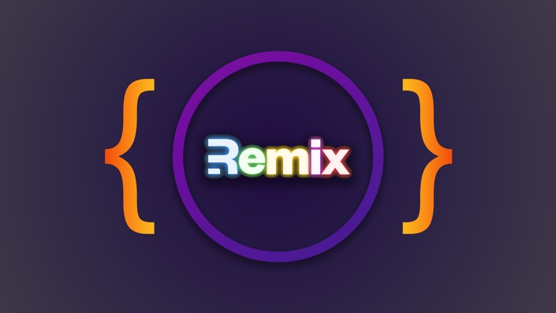

# Các kiến thức và câu hỏi phỏng vấn REMIX

1. Remix là gì và nó được phát triển bởi ai?

2. Kể tên 3 đặc điểm chính của Remix khiến nó khác biệt với các framework khác?

3. Cách cài đặt và khởi tạo một dự án Remix mới?

4. Giải thích cấu trúc thư mục cơ bản của một dự án Remix?

5. Vai trò của file `remix.config.js` trong một dự án Remix?

6. Giải thích cách hoạt động của hệ thống routing dựa trên file trong Remix?

7. Làm thế nào để tạo một route đơn giản trong Remix?

8. Sự khác biệt giữa route thông thường và route động trong Remix?

9. Giải thích cách sử dụng route params trong Remix?

10. Chức năng của file `root.jsx` trong một dự án Remix?

11. `useLoaderData` hook dùng để làm gì trong Remix?

12. Giải thích về function `loader` trong Remix và khi nào nó được thực thi?

13. Làm thế nào để truy cập request object trong một loader function?

14. Giải thích về function `action` trong Remix và khi nào nó được gọi?

15. Làm thế nào để xử lý form submission trong Remix?

16. Cách truy cập form data trong action function?

17. Làm thế nào để thực hiện redirect sau khi xử lý một action trong Remix?

18. Giải thích về `useActionData` hook và khi nào nên sử dụng nó?

19. Làm thế nào để xử lý lỗi trong Remix?

20. Giải thích về `ErrorBoundary` component trong Remix?

21. Cách sử dụng `meta` function để thiết lập metadata cho trang web trong Remix?

22. Làm thế nào để tạo một layout chung cho nhiều routes trong Remix?

23. Giải thích khái niệm "nested routes" trong Remix và lợi ích của chúng?

24. Làm thế nào để truy cập URL và các thông số query string trong Remix?

25. Cách sử dụng `useParams` hook trong Remix?

26. Giải thích về `useSearchParams` hook và cách sử dụng nó?

27. Làm thế nào để load dữ liệu từ API trong một loader function?

28. Cách sử dụng cookies trong Remix?

29. Giải thích về `useTransition` hook trong Remix?

30. Làm thế nào để hiển thị loading states khi dữ liệu đang được tải?

31. Giải thích về `Link` component trong Remix và cách nó khác với thẻ `<a>` thông thường?

32. Làm thế nào để thực hiện client-side navigation trong Remix?

33. Giải thích về `prefetch` attribute trong `Link` component?

34. Làm thế nào để tạo một form trong Remix mà không cần JavaScript?

35. Giải thích về progressive enhancement trong ngữ cảnh của Remix?

36. Làm thế nào để sử dụng CSS trong Remix?

37. Giải thích cách sử dụng `links` function để thêm stylesheet vào một route?

38. Làm thế nào để import CSS module trong Remix?

39. Giải thích về file `entry.server.jsx` và vai trò của nó?

40. Giải thích về file `entry.client.jsx` và vai trò của nó?

41. Làm thế nào để sử dụng environment variables trong Remix?

42. Giải thích về `useFetcher` hook và khi nào nên sử dụng nó?

43. Làm thế nào để xử lý form validation trong Remix?

44. Cách hiển thị validation errors trong form Remix?

45. Giải thích cách Remix xử lý hydration khi trang được load?

46. Giải thích về Resource Routes trong Remix và khi nào nên sử dụng chúng?

47. Làm thế nào để xử lý file uploads trong Remix?

48. Giải thích về cơ chế caching trong Remix và cách tối ưu hóa nó?

49. Làm thế nào để triển khai authentication trong một ứng dụng Remix?

50. Giải thích về session trong Remix và cách quản lý nó?

51. Làm thế nào để xây dựng một custom server cho Remix?

52. Giải thích về các chiến lược deployment cho ứng dụng Remix?

53. Làm thế nào để triển khai i18n (internationalization) trong Remix?

54. Giải thích về "stacked routes" trong Remix và use cases của nó?

55. Làm thế nào để tích hợp Remix với một headless CMS?

56. Giải thích về optimistic UI trong Remix và cách triển khai nó?

57. Làm thế nào để xử lý real-time updates (như WebSockets) trong Remix?

58. Giải thích về function `unstable_shouldReload` và khi nào nên sử dụng nó?

59. Làm thế nào để tối ưu hóa performance trong một ứng dụng Remix lớn?

60. Giải thích về kiến trúc của Remix runtime và cách nó xử lý request/response cycle từ đầu đến cuối?

61. Giải thích chi tiết về cơ chế "render-as-you-fetch" trong Remix và cách nó khác với các mô hình "fetch-then-render" và "render-then-fetch"?

62. Phân tích cách Remix tối ưu hóa Largest Contentful Paint (LCP) thông qua việc thiết kế API của nó. Làm thế nào việc này ảnh hưởng đến Core Web Vitals?

63. So sánh và đánh giá cách Remix xử lý hydration so với các frameworks như Next.js, Nuxt và SvelteKit? Khi nào Remix có lợi thế trong vấn đề này?

64. Làm thế nào để xây dựng một plugin hệ thống cho Remix để mở rộng khả năng mặc định của compiler?

65. Giải thích về cơ chế "module boundary" trong Remix và cách nó giúp bạn tạo mã an toàn cho server/client?

66. Thiết kế một chiến lược để xử lý global state management trong Remix mà không làm mất đi các lợi ích của kiến trúc data loading của nó?

67. Phân tích các trade-offs giữa tính năng built-in forms của Remix và các thư viện form management của bên thứ ba như React Hook Form hoặc Formik?

68. Làm thế nào để tích hợp GraphQL và code generation với Remix trong khi vẫn duy trì các lợi ích về server rendering và progressive enhancement?

69. Xây dựng một chiến lược để làm việc với WebSockets trong Remix mà vẫn giữ được các lợi ích về cached responses và optimistic UI?

70. Hiện thực hóa một hệ thống permission-based routing trong Remix mà có thể làm việc ở cả client và server?

71. Làm thế nào để tạo ra một middleware system cho Remix để xử lý cross-cutting concerns trong ứng dụng lớn?

72. Thiết kế một cơ chế để xử lý nhiều tenant (multi-tenancy) trong một ứng dụng Remix mà có performance tốt?

73. Xây dựng một chiến lược để kết hợp Server-Sent Events (SSE) với kiến trúc data loading của Remix?

74. Phân tích cách để thực hiện code-splitting tối ưu trong một ứng dụng Remix lớn với nhiều routes và shared components?

75. Làm thế nào để xử lý các inconsistencies giữa server và client rendering khi làm việc với các third-party libraries phức tạp trong Remix?

76. Thiết kế một pattern để tích hợp một hệ thống analytics phức tạp vào Remix mà vẫn đảm bảo privacy và performance?

77. Giải thích cách để hiện thực distributed caching layer cho một ứng dụng Remix trong môi trường microservices?

78. Làm thế nào để tối ưu hóa Time to Interactive trong một ứng dụng Remix có nhiều JavaScript phía client?

79. Đánh giá và giải quyết các vấn đề về concurrency khi xử lý mutations song song trong Remix?

80. Thiết kế một cơ chế để xác thực và authorization token rotation mà hoạt động trên cả SSR và CSR trong Remix?

81. Phân tích các kỹ thuật để debug và profile một ứng dụng Remix trong production environment?

82. Làm thế nào để xây dựng một cơ chế testing end-to-end hiệu quả cho một ứng dụng Remix phức tạp?

83. Giải thích cách để xử lý cross-site request forgery (CSRF) protection trong một ứng dụng Remix có nhiều entry points?

84. Thiết kế một cơ chế để handle business logic phức tạp và domain-driven design trong hệ thống folder structure của Remix?

85. Làm thế nào để xử lý việc chuyển từ một single-page application (SPA) lớn sang Remix mà vẫn duy trì tính liên tục của trải nghiệm người dùng?
